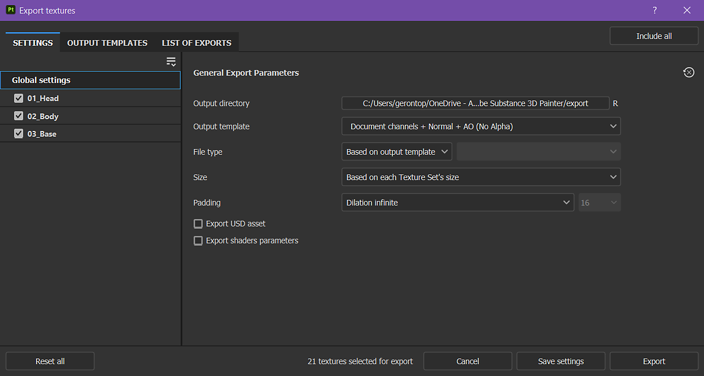
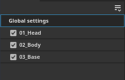
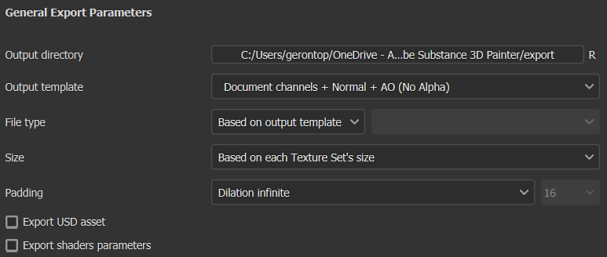
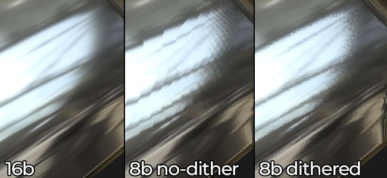
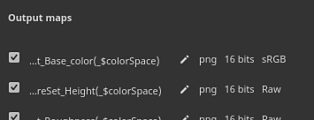
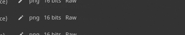

# Export settings

{width="500px"}

The <b>Export settings tab</b> of the <b>Export textures window</b> allows you to configure the composition, size, and location of exported textures.

## General and Texture Sets configuration

The first element of the window is the list of Texture Sets on the left. The Global settings section gives access to common parameters across all Texture Sets. This makes it easy to adjust a single set of settings to apply to all of the project's texture sets. Changes made to individual texture set settings will override the global settings for that texture set. For example, setting resolution to 2048 in the global settings and 1024 as an override for a specific Texture Set will result in all texture sets being exported at 2048 resolution except for the one set to 1024.

The checkbox next to each Texture Set name signifies if the associated textures will be exported or not.

The dropdown menu is useful with projects that have a large number of texture sets, as it allows you to quickly modify the selection with <b>Check all</b>, <b>Uncheck all</b>, and <b>Invert all </b>actions.

## General export parameters

This section contains the shared settings for each textures that will be generated:

| Setting | Description |
| --- | --- |
| <b>Output directory</b> | Save location for exported textures. |
| <b>Output template</b> | Select the output template used to name and composite the channels into texture files. For more information on templates see the [Output templates](../../../../getting-started/export/export-presets/export-presets.md) list. |
| <b>File type  </b> | The file format and its bit depth. If the option <b>Based on output template</b> is selected, the file format is inherited from the export preset (which allows format and bit depth to be determined per texture instead of globally). The available bit depth depends on the file type; see the table below for more information. |
| <b>Size  </b> | The resolution of the exported texture file. Possible values:<ul data-preserve-html="true"> <li data-preserve-html="true"><b>Based on each Texture Set's size</b></li> <li data-preserve-html="true"><b>128</b></li> <li data-preserve-html="true"><b>256</b></li> <li data-preserve-html="true"><b>512</b></li> <li data-preserve-html="true"><b>1024</b></li> <li data-preserve-html="true"><b>2048</b></li> <li data-preserve-html="true"><b>4096</b></li> <li data-preserve-html="true"><b>8192</b> (only available with GPUs that have more than 1.5GB of Vram)</li> </ul> |
| <b>Padding  </b> | How the area outside the UV islands is filled inside the texture. Possible values are:<ul data-preserve-html="true"> <li data-preserve-html="true"><b>No padding (passthrough)</b>: use the current state of the texture as-is.</li> <li data-preserve-html="true"><b>Dilation infinite</b>: stretch UV island borders until they reach neighbor borders or the end of the texture.</li> <li data-preserve-html="true"><b>Dilation + transparent</b>: stretch UV island borders to the given distance in pixels, the rest is transparent.</li> <li data-preserve-html="true"><b>Dilation + default background color</b>: stretch UV island borders to the given distance in pixels, the rest is filled with the default color of the Texture Set's channel.</li> <li data-preserve-html="true"><b>Dilation + default background color</b>: stretch UV island borders to the given distance in pixels, the rest is filled with the default color of the Texture Set's channel.</li> <li data-preserve-html="true"><b>Dilation + diffusion</b>: stretch UV island borders to the given distance in pixels, the rest is filled with a blurry version of the UV island (based on mip-maps).</li> </ul> |

>[!NOTE]
>
> The **psd** file format is a container, this means that output maps will be gathered together inside a single file on disk.

### Dithering

Exporting 8bit textures can lead to banding in gradients. This is especially noticeable with Normal and Height maps. There are two ways to solve that issue: using higher precision or compensating with dithering.

Higher precision (16 or 32 bit) is ideal, but this may not be compatible with all applications. Most notably, Game engines often compress to 8bit. Dithering introduces noise which helps to mitigate banding issues while still using 8 bits of information.

### Texture file formats

Below is a list of all the export file format supported by Painter:

| Format name | Format extension | Supported bit-depth |
| --- | --- | --- |
| **Bitmap** | bmp | 8, 8 + dithering |
| **OpenEXR** | exr | 16 (floating), 32 (floating) |
| **Graphics Interchange Format** | gif | 8, 8 + dithering |
| **Radiance HDR** | hdr | 32 (floating) |
| **Icon** | ico | 8, 8 + dithering |
| **Jpeg 2000** | j2k | 8, 8 + dithering, 16 |
| **Jpeg Network Graphics** | jng | 8, 8 + dithering, 16 |
| **Jpeg 2000** | jp2 | 8, 8 + dithering, 16 |
| **Jpeg** | jpeg | 8, 8 + dithering |
| **JPEG extended range** | jpeg-xr | 8, 8 + dithering, 16, 32 (floating) |
| **Portable Bit Map** | pbm | 8, 8 + dithering, 16 |
| **Portable Float Map** | pfm | 32 (floating) |
| **Portable Gray Map** | pgm | 8, 8 + dithering, 16 |
| **Portable Network Graphics** | png | 8, 8 + dithering, 16 |
| **Portable Pixel Map** | ppm | 8, 8 + dithering, 16 |
| **Photoshop Document** | psd | 8, 8 + dithering, 16 |
| **Truevision TGA** | targa | 8, 8 + dithering |
| **Tag Image File Format** | tiff | 8, 8 + dithering, 16, 32 (floating) |
| **Wireless Application Protocol Bitmap Format** | wbmp | 8, 8 + dithering |
| **WebP** | webp | 8, 8 + dithering |
| **X PixMap** | xpm | 8, 8 + dithering |

## Output maps

When a specific texture set is selected, the Output maps section is visible for that texture set.

This section lists all the textures that will be generated based on the current export preset. It indicates the texture name template, the file format, and bit depth, and the color space as well if [Color management](../../../../features/color-management/color-management.md) is enabled.

This section allows you to disable the export of specific files or to override the <b>file format</b> and <b>bit depth</b>.

## Export USD asset

Checking this box will allow you to export in USD format. Unlike the USDz (Apple AR) preset available in <b>Output templates</b>, this export will take into consideration any template or parameter you've configured for your export. The following files are exported when you check the USD asset box -

* A folder with texture maps
* A *.usda* which points to the texture maps folder.
* An optional .usd that assembles materials with the original mesh file. It can be used directly in Omniverse to show your mesh with materials applied automatically.
* An optional .usd file, which includes the mesh used in the project. It is exported only if the original mesh file is not a USD or if Painter's auto-unwrap was used to generate UVs.
