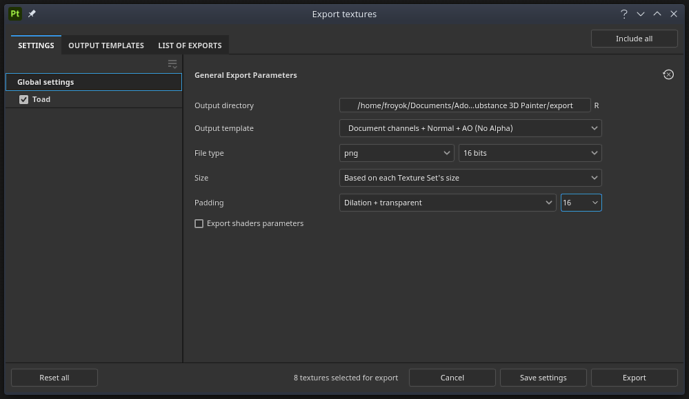

# Export window

{width="500px"}

Open the <b>Export window </b>with <b>File &gt; Export textures </b>or keyboard shortcut <b>Ctrl + Shift + E</b>.

The <b>Export window </b>is divided into three tabs:

* [Export settings](../../../getting-started/export/export-window/export-settings/export-settings.md)
* [Output templates](../../../getting-started/export/export-window/output-templates/output-templates.md)
* [List of exports](../../../getting-started/export/export-window/list-of-exports/list-of-exports.md)

The bottom of the window has several buttons:

* <b>Reset all</b> (only on the <b>Settings tab</b>): reset the export configuration of the project.
* <b>Cancel</b>: Close the window without saving any changes.
* <b>Save settings</b>: Save the current export settings into the project.
* <b>Export</b>: Start the export with the current export settings and automatically switch to the <b>List of exports</b> section to track export progress.
