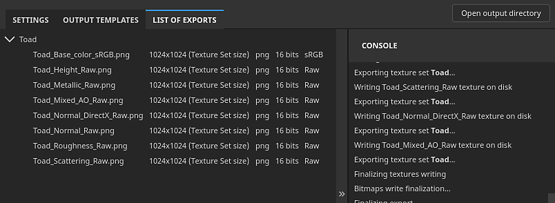

# List of exports

{width="550px"}

The <b>List of export tab </b>of the <b>Export window </b>lists the exported textures from each Texture set, with a console indicating the status of the export, including error messages.
