# Output templates

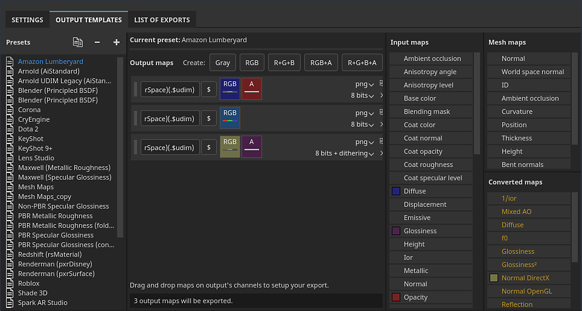{width="500px"}

The Output template tab allows you to manage and create new Output templates. You can use Output templates to modify the names, formats, and configuration of exported textures.

## Presets list

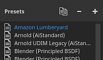

The Presets list show all the available Output templates. This list includes a collection of [Default Output templates](../../../../help/getting-started/export/export-presets/default-presets/default-presets.md), as well as any custom templates that you have created.

From this list, templates can be <b>created</b>, <b>renamed</b>, <b>duplicated,</b> or <b>deleted</b>.

| Action | Visual | Description |
| --- | --- | --- |
| **Duplicate** | 
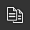
 | Create a copy of the currently selected output template in the list. |
| **Remove** | 
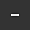
 | Remove the currently selected outpute template in the list.  **Note:**  Deleting a template cannot be undone. |
| **Add** | 

 | Add a new empty output template. |
| **Double-click** | 
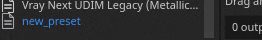
 | Rename the selected output template. |
| **Right-click** | 
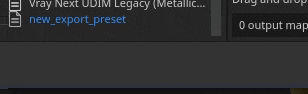
 | Right-click on a tempate to open the contextual menu where you can delete, rename, or duplicate a template. |

## Output maps list

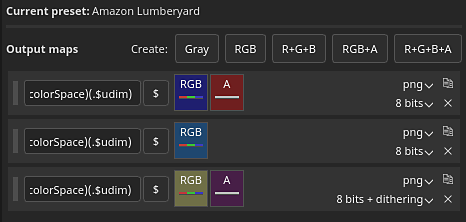

This section lists all the textures that will be generated by the template and their composition.

### Map types and keywords

The top line list all the type of texture types that can be made:

| Button | Visual | Description |
| --- | --- | --- |
| **Gray** | 
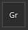
 | Add a new grayscale map. |
| **RGB** | 
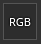
 | Add a new RGB color map. |
| **R+G+B** | 
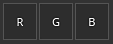
 | Add a new RGB map with 3 individual grayscale slots. |
| **RGB+A** | 
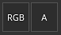
 | Add a new RGB map plus an alpha (grayscale) slot. |
| **R+G+B+A** | 
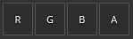
 | Add a new RGBA map with 4 individual grayscale slots. |

>[!NOTE]
>
> Some types can be merged/collapsed when they are empty or share the same input map:
> 
> 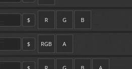

### Map name

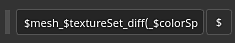

Each texture can be named using a custom naming convention. A few keywords can be added (with the help of the **$** button) to be automatically replaced by the application when generated the final file:

| Keyword | Description |
| --- | --- |
| **$project** | Replaced by the name of the project file (.spp). |
| **$mesh** | Replaced by the name of the mesh file (input mesh file, like .fbx) |
| **$textureset** | Replaced by the name of the material/Texture Set from which the texture is generated from. |
| **$udim** | Replaced by the UDIM number from which a texture is generated from. |
| **$colorSpace** | Replaced by the name of the color space used for the given channel (RGB or G, ignores Alpha). |

### Map file format and bit depth

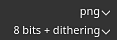

The first dropdown can be used to specify the file format of the current output map.

The second dropdown is sued to specify the bit depth of the output map. The bit depth depends on the file format selected. See [Export settings](../../../../help/getting-started/export/export-window/export-settings/export-settings.md) for more details.

>[!NOTE]
>
> For the format and bit depth setting to be taken into account when exporting, make sure the file type in the general settings is set to **Based on output template**.

## Source map list

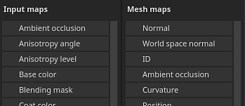

### Input maps

The input map list regroups all the channels that can be added via the [Texture Set settings](../../../../help/interface/texture-set/texture-set-settings/texture-set-settings.md).

>[!NOTE]
>
> The **user** channels are based on their original name (**user\_x**), custom names are ignored.

### Mesh maps

The mesh maps are the baked textures:

| Name | Description |
| --- | --- |
| **Normal** | Baked normal map. |
| **World space normal** | Baked world space normal. |
| **ID** | Baked ID. |
| **Ambient occlusion** | Baked ambient occlusion |
| **Curvature** | Baked curvature. |
| **Position** | Baked position. |
| **Thickness** | Baked thickness. |
| **Height** | Baked height. |
| **Bent normals** | Baked bent normals. |

### Converted maps

Converted maps are maps that are generated by the application from another source:

| Name | Description |
| --- | --- |
| **Normal OpenGL** | Combined normal map in OpenGL format of the baked normal and the Texture Set's normal channel. |
| **Normal DirectX** | Combined normal map in DirectX format of the baked normal and the Texture Set's normal channel. |
| **Mixed AO** | Combined ambient occlusion of the baked ambient occlusion and the Texture Set's ambient occlusion channel. |
| **Diffuse** | Diffuse texture generated from the **Base Color** and **Metallic** channel (metallic areas are replaced by a black color). |
| **Specular** | Specular texture generated from the **Base Color** and **Metallic** channel. |
| **Glossiness** | Glossiness texture generated from the inverse of the roughness channel. |
| **Unity4 Diffuse** | Deprecated. Diffuse texture generated from **Base Color** channel to match Unity 4 shaders. |
| **Unity4 Gloss** | Deprecated. Glossiness texture generated from **Roughness** and **Metallic** channel to match Unity 4 shaders. |
| **Reflection** | Textures where white indicates a dielectric material and other colors as metallic materials. |
| **1/ior** | Texture containing 1 divided by the **IOR** value. **IOR** is generated from the metallic map: 1.4 for dielectrics, 100 for metals (black color). |
| **Glossiness²** | Square version of the **Glossiness** channel (**Glossiness** \* **Glossiness**) |
| **f0** | Texture containing reflectance value as fresnel 0 (0.04 for dieletrics, 1.0 for metallic). |
