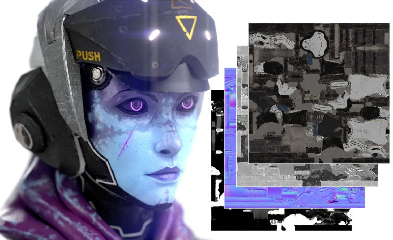

# Export

## Export Textures

Textures are exported as a collection of bitmaps. Painter offers a lot of flexibility when exporting textures thanks to Output templates. Output templates let you control things like the naming of exported files, how textures are packed into channels, and the format and bit depth of the exported files. If this sounds intimidating, don't worry, Painter includes dozens of default Output templates that are configured for commonly used 3D applications and use cases.

You open the <b>Export window</b> and start exporting textures with <b>File &gt; Export Textures</b>, or use keyboard shortcut <b>CTRL + SHIFT + E</b>. Use the following links to learn more about Exporting textures:

* [Export window](../../help/getting-started/export/export-window/export-window.md)
* [Output templates](../../help/getting-started/export/export-presets/export-presets.md)
* [Modify or create Output templates](../../help/getting-started/export/creating-export-presets/creating-export-presets.md)

### Export your mesh

Painter can modify your imported mesh, for example, by automatically generating UVs. If you've made changes to the mesh in Painter, you can export the mesh with <b>File &gt; Export Mesh</b>.

When exporting a mesh you will have a few options:

* <b>Without displacement/tessellation</b>: exports the base mesh without modifying the geometry based on materials.
  * <b>Apply triangulation</b>: If the imported mesh was made of quads or polygons, you can enable this option to export the Painter triangulated version of the mesh. This can help avoid visual triangulation based bugs in case other applications triangulate differently.
* <b>With displacement/tessellation</b>: Painter tessellates the mesh, adding more polygons, and uses displacement or height to change the surface geometry of the mesh.
  * <b>Recompute vertex normals</b>: modifying the surface of the mesh can result in incorrect normals of pre-existing vertices. By enabling this option, Painter will automatically update vertex normals to the correct value for the new surface.

{width="500px"}
