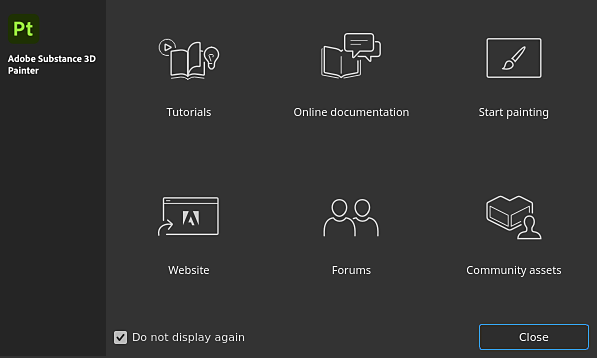

# Getting Started

From the <b>Welcome screen</b> window, you can access the following pages:

* [Tutorials](https://www.adobe.com/go/substance3dpaintertutorials)
* Online Documentation (You're already here!).
* Start Painting: load the "Meet Mat" sample project.
* [Website](https://www.adobe.com/creativecloud/3d-augmented-reality.html)
* [Forums](https://community.adobe.com/t5/substance-3d-painter/bd-p/substance-3d-painter?filter=all&amp;page=1&amp;sort=latest_replies)
* [Community assets](https://helpx.adobe.com/substance-3d-community-assets/home.html)

Otherwise, get started with the basics of project creation and texture exports:

* [Project Creation](../getting-started/project-creation/project-creation.md)
* [Export](../getting-started/export/export.md)
* [Glossary](../getting-started/glossary/glossary.md)
* [Performance](../technical-support/performances-guidelines/performances-guidelines.md)
* [Activation and licenses](../getting-started/activation-and-licenses/activation-and-licenses.md)
* [System requirements](../getting-started/system-requirements/system-requirements.md)

To accelerate your workflow, take a look at the list of shortcuts:

* [Shortcuts ](../interface/settings/shortcuts/shortcuts.md)

{width="500px"}
