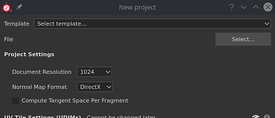
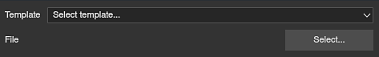
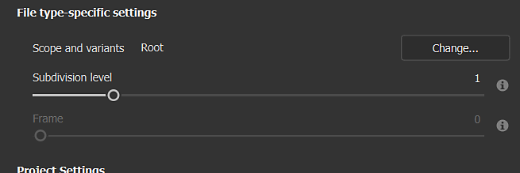
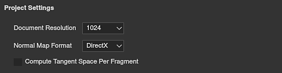
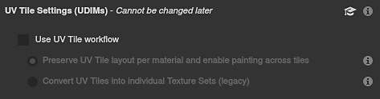
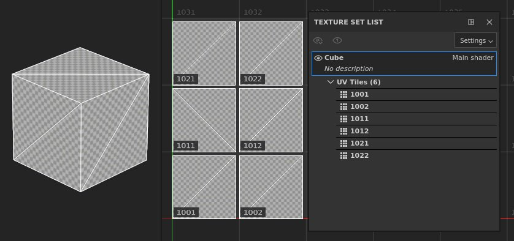
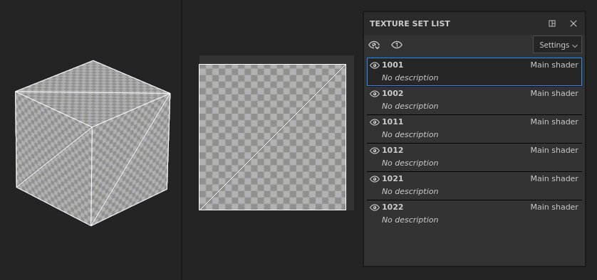
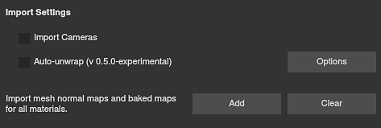
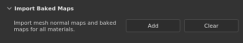
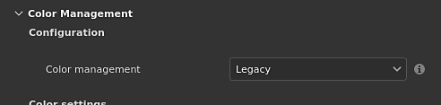

# Project Creation

The <b>New project window </b>allows you to create a project file to store your 3D model and its texturing information.

A new [Texture Set](../../interface/texture-set/texture-set.md) is created per material definition found on the imported 3D model. This means multiple objects can be imported through a single file (even with overlapping UVs) if they have different materials.

## Creating a New Project

To create a new project, click on <b>File &gt; New</b> or use keyboard shortcut <b>Ctrl + N</b>.

Below is an explanation of all the parameters available in the New Project window.

### Base Settings

| *Parameter* | *Description* |
| --- | --- |
| **Template** | Specify a template that will define the default settings of the project. A template contains the following parameters:<ul data-preserve-html="true"> <li data-preserve-html="true">Texture Set settings.</li> <li data-preserve-html="true">Display settings.</li> <li data-preserve-html="true">Baking settings.</li> <li data-preserve-html="true">Shader resources (including attached textures).</li> <li data-preserve-html="true">Environment Map file.</li> </ul>  **Note:**  Templates are **\*.spt** files that are created from an existing project via the [File menu](../../interface/main-menu/file-menu/file-menu.md) and saved inside the [Assets](../../interface/assets/assets.md) folder to be easily shared with team members. |
| **File** | Click on the "Select" button to specify a 3D model file to load. [A list of supported file formats is available here.](https://helpx.adobe.com/substance-3d-general/ecosystem/import-and-export-formats.html) |

### File type-specific settings

When a USD is selected, other file type-specific settings become available.

{width="473px"}

| *Parameter* | *Description* |
| --- | --- |
| <b>Scope and variants</b> | Select a specific part of a USD file. By default, this is set to 'Root', which means the entire USD file will be used to create the Painter project.  <b>Change...</b> opens a new window that displays the contents of the USD. If variants are detected, it is possible to select a specific variant for project creation. Scope and variants can be changed after project creation in [Project configuration](../../interface/project-configuration/project-configuration.md) settings. Note that -<ul data-preserve-html="true"> <li data-preserve-html="true">Only the modeling variant selection will have any impact on the project.</li> <li data-preserve-html="true">Variants nested within variants are not currently detected.</li> </ul> |
| <b>Subdivision level</b> | For geometry that should be subdivided, this setting allows you to specify how much you would like to subdivide your mesh for texturing in Painter. If subdivision is explicitly set to 'none' within the USD file, this setting is grayed out.  Subdivision is applied after UV unwrapping, so this does not alter the shape of the mesh's UVs. Subdivision levels can be changed after project creation in [Project configuration](../../interface/project-configuration/project-configuration.md) settings. |
| <b>Frame</b> | For USD files where animations are detected, this setting allows you to select the frame which will be used to create your Painter project. If there is no animation in the selected USD file, this setting is grayed out. Frame can be changed after project creation in [Project configuration](../../interface/project-configuration/project-configuration.md) settings. |

### Project Settings

| *Parameter* | *Description* |
| --- | --- |
| **Document Resolution** | Define the default texture resolution of the project for each Texture Set. The resolution can go up to 4K (4096x4096 pixels) when working inside the application and 8K (8192x8192 pixels) when exporting. The resolution can be changed at any time later on via the [Texture Set settings](../../interface/texture-set/texture-set-settings/texture-set-settings.md).  **Note:**  8K export requires at least 2.5GB of VRam on the GPU to be available. |
| **Normal Map Format** | Defines the Normal map format for the project, can be either<ul data-preserve-html="true"><li data-preserve-html="true"><strong>DirectX</strong> (X+, Y-, Z+)</li><li data-preserve-html="true"><strong>OpenGL</strong> (X+, Y+, Z+)</li></ul>  **Note:**  As a reminder:<ul data-preserve-html="true"> <li data-preserve-html="true"><b>Unreal Engine</b> uses DirectX by default.</li> <li data-preserve-html="true"><b>Unity</b> uses OpenGL by default.</li> </ul> |
| **Compute Tangent Space per Fragment** | If enabled, the Bitangents are computed in the fragment (pixel) shader instead of the vertex shader. This parameter impacts the way the Normal map is decoded by the Shader in the viewport. Changing this settings will require to rebake the Normal map.  **Note:**  As a reminder:<ul data-preserve-html="true"><li data-preserve-html="true"><strong>Unreal Engine</strong> needs this setting to be Enabled.</li><li data-preserve-html="true"><strong>Unity </strong> needs this setting to be Disabled (or enabled if you are using the HDRP workflow).</li></ul>For more information see the [Tangent Space](https://helpx.adobe.com/substance-3d-bake/features/tangent-space.html) page in the Bakers documentation. |

### UV Tile Settings (UDIMs)

>[!NOTE]
>
> These settings cannot be modified once the project has been created.

| *Parameter* | *Description* |
| --- | --- |
| **Use UV Tile workflow** | If checked, the imported mesh will be processed differently to allow painting outside the regular UV range (0-1). Projects using UDIM should enable this setting. The processing of the mesh may differ depending on the setting.   For more information, see the [UV Tile documentation](../../features/uv-tiles/uv-tiles.md). |
| <b>Preserve UV Tile layout per materials and enable painting across tiles</b> | UV Tiles (UDIMs) are imported and grouped per material assignment on the mesh. This means a single Texture Set can contain multiple UV Tiles visible side by side in the 2D View. UV Tiles that are within the same Texture Set can be painted across seamlessly.  

 |
| <b>Convert UV Tiles into individual Textures Sets (legacy)</b> | UV Tiles (UDIMs) are separated into individual Texture Sets and renamed, ignoring any material assignments. Each UV Tile is moved to the UV &#91;0-1&#93; range to be paintable.  

 |

### Import Settings

| ***Parameter*** | ***Description*** |
| --- | --- |
| **Import Cameras** | If cameras are present in the mesh file, they will be imported into the project and accessible as presets for visualization.  **Note:**  Substance 3D Painter doesn't support some cameras in certain conditions :<ul data-preserve-html="true"><li data-preserve-html="true">Physical cameras from 3DS Max.</li><li data-preserve-html="true">Orthographic cameras stored in Alembic files (&#42;.abc).</li></ul> |
| **Auto-unwrap** | If enabled, missing UVs on the imported mesh will be generated. The processing may change depending on the settings selected via the **Options** button.For more information, see the [Automatic UV Unwrapping documentation](../../features/automatic-uv-unwrapping/automatic-uv-unwrapping.md). |

### Import baked maps

Use the <b>Add</b> button to load texture files as Mesh maps and automatically assign them in the [Texture Set settings](../../interface/texture-set/texture-set-settings/texture-set-settings.md). A specific naming convention must be followed for the mesh maps to be automatically assigned to their Texture Sets. Mesh maps can also be baked directly inside the application; see the Baking documentation.

Naming convention:<b> TextureSetName\_MeshMapName</b>

Example:<b> DefaultMaterial\_ambient\_occlusion.png </b>

List of supported Mesh maps and their naming:

| *Mesh map* | *Filename convention* |
| --- | --- |
| **Ambient occlusion** | ambient\_occlusion |
| **Curvature** | curvature |
| **Normal** | normal\_base |
| **World Space Normal** | world\_space\_normals |
| **ID** | id |
| **Position** | position |
| **Thickness** | thickness |

### Physical size

Physical size settings allow you to adjust how Painter determines the physical size of your mesh in real world units. This is useful to make sure that materials are applied at a realistic scale.

* Use mesh file's internal unit scale: Most file types include information about the physical size of the object as it was exported from the 3D modeling application. With this option selected, Painter will use this information from the imported file.
* Custom unit scale: Overwrite the unit scale of the imported file, or if no unit scale is included, use the custom entry box to adjust the size of a single "unit".
* Switch fill layer scaling to Physical size when assigning materials: If this is enabled, materials that have physical size information can adjust their scaling to match the physical size of the surface to which they're being applied.

### Color management

This section controls the project's color management settings. By default, it is set to Legacy (sRGB / linear workflow).

Take a look a the [color management](../../features/color-management/color-management.md) documentation to learn more about how to use this workflow and what the settings are doing.
