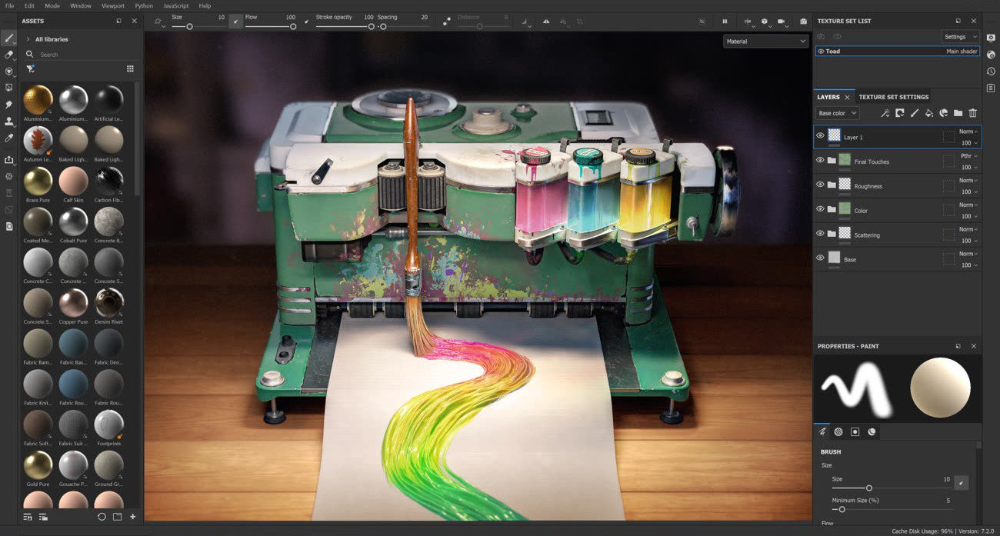

# Substance 3D Painter

<table>
<tr style="border: 0;">
<td width="41.60%" style="border: 0;" valign="top">

Substance 3D Painter is a 3D painting software allowing you to texture and render your 3D meshes.

This documentation is designed to help you learn how to use this software, from basic to advanced techniques.

If you have any question that is not answered in this manual feel free to ask on our [Forum](https://community.adobe.com/t5/substance-3d-painter/bd-p/substance-3d-painter). You can also download our [Physically Based Rendering guide](https://helpx.adobe.com/substance-3d/unlisted/tutorials.html) if you wish to learn more about PBR.

</td>
<td width="58.30%" style="border: 0;" valign="top">

{width="600px"}

</td>
</tr>
</table>

## Release Notes

* [All Changes](../release-notes/all-changes/all-changes.md)
* [Version 11.1](../release-notes/version-11-1/version-11-1.md)
* [Version 11.0](../release-notes/version-11-0/version-11-0.md)
* [Version 10.1](../release-notes/version-10-1/version-10-1.md)
