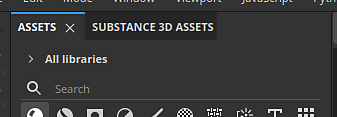
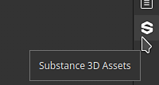
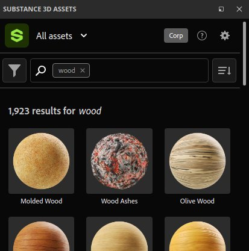
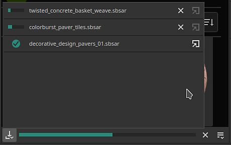
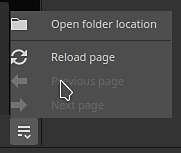

# Substance 3D Assets

The <b>Substance 3D Assets</b> dock allows to browse the online library of the same name directly within the application. The original library is available at the following adress: <https://substance3d.adobe.com/assets>

>[!NOTE]
>
> The Substance 3D Assets window is not available with the Steam version of the application.

## Location

By default, the window is docked as a tab next to the general Assets window. If the window is closed, it can be opened again from the dock toolbar on the far right of the interface.

### Browsing assets

To browse assets you can use the interface available within the window. The top shows a search field to refine your search and a filter is also available.

### Downloading assets

Once you click on the download button of an asset, they will start downloading and appear within the donwload manager of the window. To view it simply click on the bottom left button of the window.

This list only displays assets downloaded during the current session of the application.

Once an asset has been downloaded successfully it will appears within the regular <b>Assets</b> window.

>[!NOTE]
>
> The location where resource are downloaded depends on the default library. This location can be changed in the preferences, see the dedicated [documentation page](../../interface/assets/adding-a-new-library/adding-a-new-library.md).

### Control menu

The button on the bottom right of the window offers a few actions:

* <b>Open folder location</b>: open the file explorer to the location of the current library. This allows to browser on disk the downloaded assets (included past sessions).
* <b>Reload page</b>: reload the interface within the window.
* <b>Previous page</b>: navigate to the previous interface within the window.
* <b>Next page</b>: navigate to the next interface within the window.

