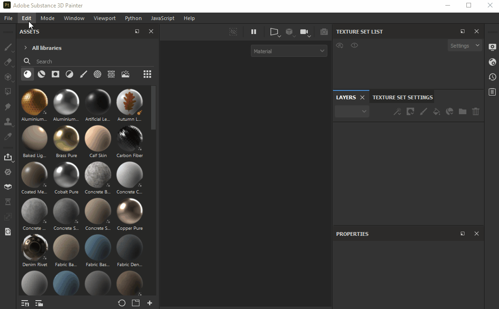

# Adding a new library

It is possible to add a new library location in case you would like to change your import location to something other than the Documents folder, or there is an already existing collection of assets on your disk that you'd like to make accessible in Painter.You can manage your libraries via the Settings menu, however note that **no project should be open** in order to use this menu. Once you add a new library to Painter, it will automatically create the same (empty) folders as you see in the default asset location (*alphas*, *colorluts*, *effects*, etc.). Placing assets in a specific folder will assign them that exact usage (you can learn more [here](../../../help/content/importing-assets/adding-content-the-hard/adding-content-on-the-hard-drive.md)). So, for example, if you would like to see your custom grayscale images appear under the Alpha category in the Painter UI, you will have to place those images in the *alphas* folder.

To add a new library -

1. Open Substance 3D Painter without opening a project.
1. Go to Edit &gt; Settings &gt; Libraries.
1. Click on ... next to Path field and navigate to the desired location.
1. Enter a new name for your library (note that spaces and special characters are not supported and will be converted to underscores).
1. Click the + button.
1. Your library should appear in the list.
1. *Optional:* if you would like your new library to be the default import location, select the Default button.

{width="600px"}
