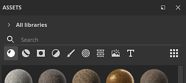
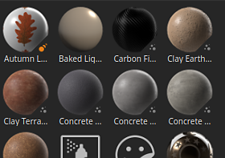
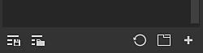

# Assets

The Asset window allows you to access the default resources that come with the application (referred to as **Starter assets**), as well as any [imported](https://helpx.adobe.com/substance-3d/unlisted/documentation/spdoc/adding-content-to-the-shelf-142213317.html) resources (which can be then found under **Your assets**).

* On disk, the **Starter assets** library is stored within the application's installation folder, whereas assets imported to **Your assets** library by default are located in the Documents folder.
* For more information on where your assets are stored on disk, see [Adding content on the hard drive](../../content/importing-assets/adding-content-the-hard/adding-content-on-the-hard-drive.md).
* It is also possible to add a different library location. For that, please take a look at [Adding a new library](adding-a-new-library/adding-a-new-library.md).

## Overview

The Assets window is divided into three main sections by default:

1. The filter area
1. The assets list
1. The bottom bar

### Filter area

For more information see the [Navigation page](navigation/navigation.md).

#### Assets list

#### Bottom bar

