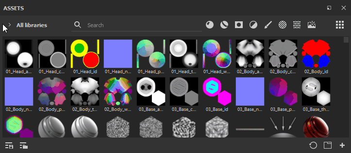
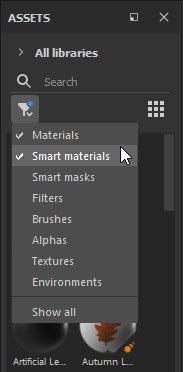
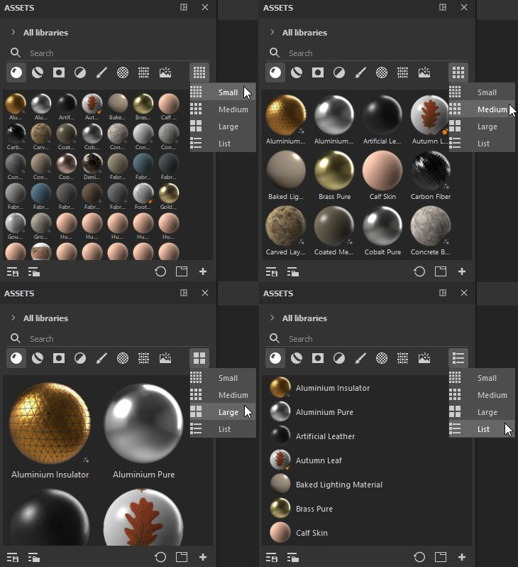

# Customizing the layout

There are a few interface options, such as sub-libraries, reduced width and thumbnail size, which allow you to change the Assets panel layout to suit your needs.

>[!NOTE]
>
> Assets can be scrolled through using the mouse wheel or manipulating the scroll bar, or an alternative method to scroll in any Painter window is to **maintain Ctrl + Alt and drag** within the desired panel.

Docking and Orientation

When you first open Painter after installation, you will find the Asset window docked vertically on the left of the app. However it can undocked and placed horizontally. And if you use additional [sub-library](../../../interface/assets/sub-library-tab/sub-library-tab.md) windows, they too can be docked and undocked at will.

{width="600px"}

## Reduced Width

Its size can be reduced, in which case asset types collapse into a single menu where you can select one or multiple options.

## Thumbnail Size

Asset thumbnail size can be adjusted using the left-most icon, which offers Small, Medium (default), Large and List options.

{width="600px"}
