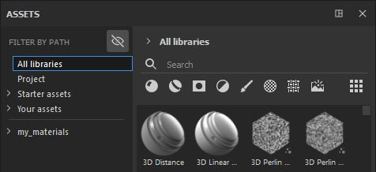
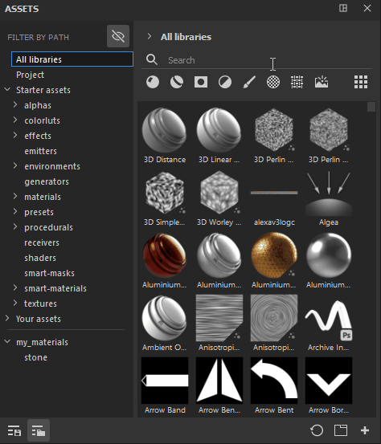

# Filter by path

**Filter by path** is additional section that can be used to navigate through your assets. It has the same structure as the breadcrumbs, which means it allows you to see the path/location of your assets.

By default, **Hide non-applicable folders** is activated, which allows you to hide empty folders from the UI. This can come in handy if, for instance, you combine Filter by path with a specific search word or selecting a type of asset - it will allow you to only see the relevant locations that contain your search.

