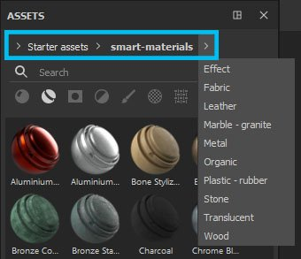
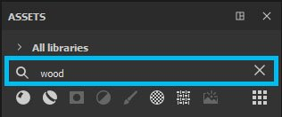
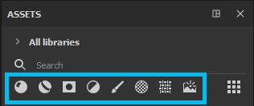
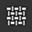

# Navigation

There are several means of navigation in the Assets window - breadcrumbs, search field and asset types icon. All navigation types are co-dependent, so you can combine those searches to your advantage.  
For example, if you have Materials selected in your asset type icons, but you used the breadcrumbs to navigate to the Smart Masks folder, the Asset panel will not display any results - you will have to go back to All libraries if you want to display Materials or deselect Materials if you want to browse the Smart Masks.

## Breadcrumbs

Breadcrumbs allow you to quickly navigate through the library. Clicking the arrows displays how the assets are stored on disk and lets you select any of the displayed location. If it is grayed out, it means there are no assets of the selected type within that folder, but you can still navigate to that location.

## Search field

The search field can be used to filter resources which contain the typed query. Note that it does not only search through by the title of the resources, but also their location, and any tag contained within the resource.   
Typed searches can also be more advanced than just keywords. See [Advanced search queries](../advanced-search-queries/advanced-search-queries.md).

## Asset types

>[!NOTE]
>
> Asset type icons can be multi-selected by maintaining **Ctrl** when clicking.

The default selection is Materials, but clicking on other asset type icons displays other types of resources.

| Asset types | Description |
| --- | --- |
| Materials 

 | Contain .sbsar imported as *basematerial* and materials created from a Fill layer (you can learn more about preset creation [here](https://helpx.adobe.com/substance-3d/unlisted/documentation/spdoc/creating-and-saving-a-preset-180191514.html)).They are basic materials that can be used in Fill layers and will apply to the whole surface of your mesh or Texture Set. |
| Smart materials 

 | Contain more complex materials consisting of multiple layers saved within a folder (Smart Materials are also presets you can create yourself).Like base materials, Smart Materials will apply to the entirety of your mesh/Texture Set but they also take into account your mesh's individual information, such as Curvature, Occlusion or any other surface detail. To obtain these surface details and use Smart Materials correctly, your mesh first needs to be [baked](../../../baking/baking.md). |
| Smart masks 

 | Contain more complex masks that use multiple layer effects and/or generators. You can [create](https://helpx.adobe.com/substance-3d/unlisted/documentation/spdoc/managing-assets-217187091.html) Smart Masks presets yourself.Similar to Smart Materials, Smart Masks need baked information from your mesh to work correctly. |
| Filters 

 | Contain .sbsar files imported as *filter*.Filters are effects that take your already present texture and transform it in some way. Some filters will work only with black and white information, some only with material inputs, which means not all filters can be used in masks. |
| Brushes 

 | Contains brushes, particles and tools. These are all presets that can be [created](https://helpx.adobe.com/substance-3d/unlisted/documentation/spdoc/managing-assets-217187091.html) in Painter.**Brushes** are basic black and white presets that use an alpha. You can use brushes to paint in any or all channels or in a mask.**Particles** have the same characteristics as Brushes, but they also have an additional set of parameters that simulate physical interaction with your mesh. They can produce the effects of spills, drips, rain or any other that require a physical simulation.**Tools** can contain Brush and/or Particle behavior, but additionally this preset is also saved with Material channels information. |
| Alphas 

 | Contain a variety of alphas, as well as several Brush Makers that allow to [create](https://helpx.adobe.com/substance-3d/unlisted/documentation/spdoc/managing-assets-217187091.html) brushes with more elaborate effects (Photoshop-like, dynamic strokes, paint roller).Alphas are grayscale images in which black parts appear transparent when used. |
| Textures 

 | Contain grunges, procedurals, baked maps, hard-surface normals and LUTs.**Grunges** are grayscale images with interesting noises and textures. They can be used to add variation to the surface of your mesh, either via mask or by plugging them in directly into a channel.**Procedurals** are also grayscale textures that comprise noises or even regular patterns. However, unlike some static grunges, procedurals are dynamic bitmaps that can be scaled without repetition and have infinite variations (via random seed).**Baked maps** represent the surface and shape information extracted from your mesh. To learn more about baking, see here.**Hard-surface normals** are details you can stamp directly onto your mesh using the Normal channel.**LUTs** (Look-up tables) are color profile textures that can be used in Display Settings to simulate a color profile behavior in the viewport. You can learn more about color profiles [here](../../../features/post-processing/color-profile/color-profile.md). |
| Environment maps 

 | Contain images imported as *environment* (most commonly .hdr or .exr).Environment maps are background images that automatically generate a lighting setup. You can use an environment map by dragging it directly into the viewport or by going through the Display Settings. |
