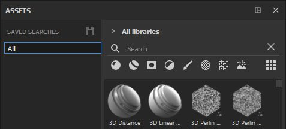
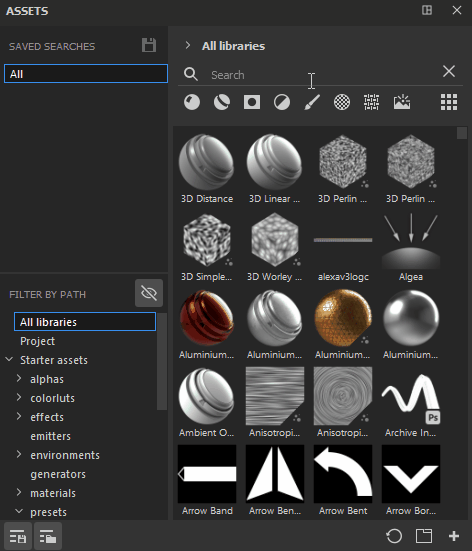
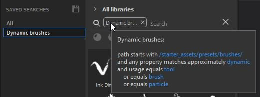

# Saved searches

Saved searches, alongside Filter by path, is another new section that can be opened within the Asset window. It allows you to save your most frequent searches and queries, easily access them at any time and even open them as a new sub-library tab that can be docked separately.

To create a saved search, it is possible to combine different types of navigation - you can type a written query in the search field, select the desired asset type (or several asset types) and a location either via Filter by path or Breadcrumbs. All these can be saved as single saved search, or they can be broken down into separate saved searches. For example, you may want to create a saved search for for brushes that use Dynamic stokes as it's something you use quite often.

>[!NOTE]
>
> Saved searches are saved in a config file that can be edited manually. To learn more, please take a look at [Adding saved searches manually](../../../pipeline-and-integration/resource-management/adding-saved-searches-man/adding-saved-searches-manually.md).

Once you create your saved search, it will appear in your list of searches. You can right-click on it to create a new sub-library tab, rename or delete it.

You can also view information about the content of your search by hovering over the search tag in the search field.

