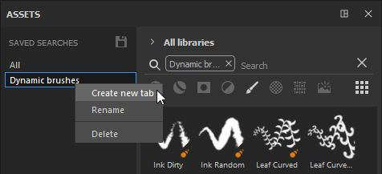
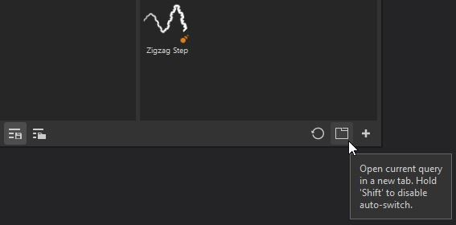

# Sub-library tab

A sub-library is a new tab or window in Substance 3D Painter dedicated to a specific search.   
There is no sub-library tab open by default, only the main Assets window. You can create sub-library tabs from the main Assets window using two methods:

* By  **right-clicking**  on one of the saved searches and choosing **Create new tab.**

* By  **choosing or entering a search query** (via asset types, breadcrumbs, text query or Filter by path) and then using the dedicated  **button**  at the bottom of the Assets window.

Creating a sub-library will automatically create a new tab and  **dock it**  in the interface within the same space as the main Assets window.

From there, the sub-library window can be docked anywhere else or left free-floating anywhere in the interface or on another screen.

>[!NOTE]
>
> * A sub-library has the same features as the main Assets window, however when reset, it will revert back to its original search query.
> * Unlike the main Asset window, if you close a sub-library, it will need to be recreated.
> * If a saved search is removed, the sub-library window will continue to exist until closed.
