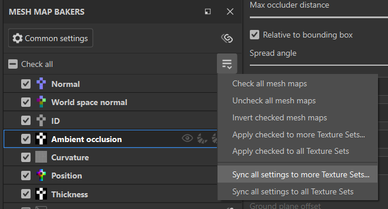

# Mesh map bakers panel

<table>
  <tr>
    <td style="border: 0;" valign="top"></td>
    <td style="border: 0;" valign="top">The <strong>Mesh map bakers panel</strong> allows you to select which maps to bake and access settings for each map type.</td>
  </tr>
</table>

## Per-map controls

Each map in the list of mesh maps has a series of controls available:

1. **Check** or **uncheck** baking for the map.
1. **Visualize** the map in the viewport.
1. **Quick bake** only this map.
1. Turn on **Auto-rebake** for the selected mesh map. **Auto-rebaked** maps will automatically be rebaked when changes are made to baking parameters or skew correction.
1. **Synchronize** settings for this map type across texture sets. Turn this off to customize baking settings for individual maps.

## Manage mesh map settings

There are multiple ways to manage your project so that baking settings are shared across mesh maps or texture sets. For complex projects, understanding how to share settings can help to simplify the baking process.

There are two types of settings that you can share across texture sets:

* Baking settings: These are parameters that you can change in the **Common settings** and the **Mesh map settings panels**.
* Check status: Use these to toggle baking on or off for specific mesh maps.

### Synchronize baking settings across texture sets

When you project has multiple texture sets, options to Synchronize across texture sets will appear in the **Mesh map bakers panel**.

Selecting the **Synchronize settings button** at the top of the **Mesh map bakers panel** opens the **Common settings sync window**.

From this window, you can select which texture sets to synchronize common settings across. With all texture sets selected, changing common settings in any texture set will change them for all other texture sets.

Similarly, if you use the **Synchronize settings button** next to an individual mesh map, you will be able to select texture sets to share the settings specific to the mesh map.

#### Share settings across unsyned texture sets

Sometimes you may want to keep mesh maps unsynchronized across texture sets, but still want to copy baking settings from one texture set to another.

To copy common settings to specific texture sets without syncing, select **Sync all settings to more Texture sets…** from the **Mesh map bakers dropdown**.

You can also use **Sync all settings to all Texture Sets** to copy settings to all texture sets in the project.

Alternatively, if you would like to copy settings for a single mesh map to specific texture sets:

1. Right click the mesh map.
1. Select **Apply &lt;mesh map&gt; settings to more Texture sets…**

*In the example above, each texture set starts with different settings for AO. Without setting the AO mesh map to be synchronized, we use **Apply Ambient occlussion settings to more Texture sets…** so we can start modifying AO settings for the new texture set from the same baseline.*

### Manage check status for mesh maps

Check status determines whether a given map is included when you bake mesh maps. There are many ways to manage check status for the current texture set:

* Check or uncheck individual maps.
* Use **Check all** or **Uncheck all** to check or uncheck all mesh maps.
* Use **Invert checked mesh maps** from the **Mesh map bakers dropdown** to switch the check status of all maps.

>[!TIP]
>
> You can click and drag from a check box to check or uncheck multiple maps quickly (see the animation above).

*In the example above, we use **Invert checked mesh maps** to quickly switch the selection and then bake mesh maps that haven’t been baked yet.*

When working with multiple texture sets, you can also copy the checked status of maps to other texture sets by selecting **Apply checked to more Texture sets…**, or copy the checked status to all texture sets with **Apply checked to all Texture sets**.

*In the example above, we haven’t yet baked the Height, bent normals, or opacity in the **Material.001** texture set. We already have these mesh maps selected in the **Material** texture set, so we use **Apply checked to more Texture sets…** and select **Material.001** to copy the checked status. We then bake the maps - notice that the visualization cycles through the mesh maps twice as the maps are baked - this is because they’re being baked for both texture sets.*