# Color picker

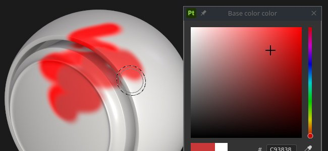

The color picker allows to set a color to paint or project on the mesh. It can be used to pick colors from external images or to adjust an existing one within the application.

The color picker window appears when clicking on any color field in Painter, which can be found in Properties or within any additional settings or menus, like Display or Shader parameters.

## Color picker overview

Once open, the color picker is semi-persistent, which means that it will stay open until a change of context - for instance, when switching from a paint layer to a fill layer. It is possible to move the window around and place it anywhere on any of the available screens. However unlike other windows the color picker cannot be docked.

The window has a vertical layout and is comprised of three sections:

* Gradient picker (or spectrum)
* Sliders (RGB/HSV)
* Swatches

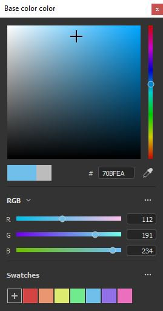{width="200px"}

### Gradient picker (spectrum)

| Name and visual | Description |
| --- | --- |
| **Display selector** 
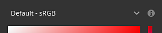
 | Allow to choose which display to use to edit colors (spectrum and sliders). The default value match the Display used by the main viewport.  **Note:**  This setting is only available when [color management](../../help/features/color-management/color-management.md) is enabled. |
| **Spectrum** 
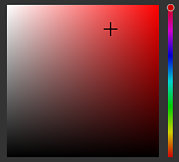
 | The vertical slider is the general hue. It allows to select the shade of color to display within the gradient field.Once the general shade is selected, it is possible to hold and drag the crosshair cursor in the gradient field to select the desired color.  **Note:**  When [color management](../../help/features/color-management/color-management.md) is enabled, HDR colors from the current Display will be clamped (in working color space). This is to avoid output HDR value in color managed channels. |
| **Current and previous color** 
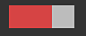
 | The left rectangle indicates the final color that will be output from the color picker.The right rectangle shows the previous color (when the color picker was opened). It is possible to click on it to restore the previous color and make it the current one. |
| **Hexadecimal field** 
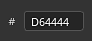
 | The hexadecimal fields represent the current color as hexadecimals values. The RGB components are represented as a pair of letters.For example #FF0000 represent the red color.  **Note:**  When [color management](../../help/features/color-management/color-management.md) is enabled, the hexadecimal field always work in the standard sRGB color space to make it easier to copy/paste values across software, no matter the current display or working space used by the project.. |
| **Eyedropper** 
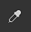
 | The eyedropper can be used to pick a color from an external source. To use it **click** on the icon then move the mouse and again to copy the color wanted.  **Note:**  When selecting a color inside the viewport, it is possible to use the **Shift** modifier to pick the current channel edited directly. This avoid doing lossy color conversion between the original texture and the color displayed on screen. This is also useful to pick colors without having to switch from the **Material** display mode. 
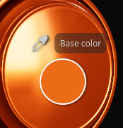
  **Note:**  Color fields also feature an eyedropper next to them and can be used to quickly pick colors without having to open the color picker. 
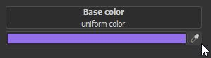
  **Note:**  On Mac OS, the eyedropper may not be able to pick colors outside of the application interface because of privacy settings. To fix this issue, assign the proper rights to the application in: `System Preferences > Security & Privacy > Privacy > Screen Recording` |

### Color settings

| Setting | Description |
| --- | --- |
| **Eyedropper color space** | Specify the color space for color selected outside of the viewport.The **auto** setting uses the Standard sRGB color space from the project settings. 
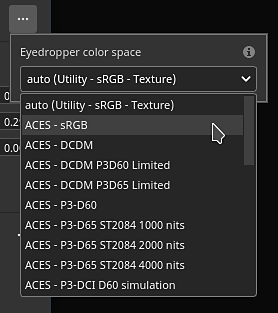
 **Note:**  This setting also applies on eyedroppers next to color buttons.  **Note:**  Colors selected inside the viewport also use this profile when not using the Shift modifier. |

### Sliders

Color sliders allow for a manual adjustment of individual values.

The sliders can be set two different modes, **HSV** or **RGB**. To change the mode, use the dedicated dropdown menu.

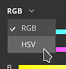

#### <b>HSV</b>

**HSV** stands for **H**ue, **S**aturation and **V**alue.

**Hue** allows to cycle through the global color families, much like the vertical gradient slider.

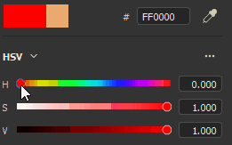

**Saturation** controls the richness of the selected color, and goes from grayscale to fully saturated.

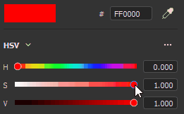

**Value** determines how dark or light a color is, and it ranges from fully black to fully white.

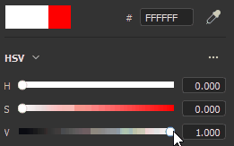

#### <b>RGB</b>

**RGB** stands for **R**ed, **G**reen and **B**lue.

These are the main components used digitally to store colors in computer graphics. Each slider represents how much of the component is present in the final color.

Example: the image below has a color that contains a 100% of red, but 50% of blue and green.

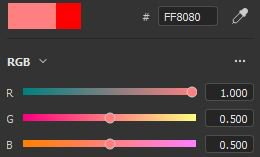

It is more common to have the RGB sliders measured via 0-255 values. This can be done by disabling the **Floating point values** option.

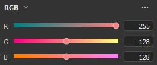

### Sliders settings

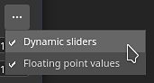

The settings menu allow to configure a few additional behaviors:

| Setting | Description |
| --- | --- |
| **Dynamic sliders** | If enabled, the background color of the sliders will adjust based on the current color. |
| **Floating point values** | If enabled, sliders values are represented going from 0.0 to 1.0.If disabled:<ul data-preserve-html="true"> <li data-preserve-html="true"><strong>HSV</strong>: the hue slider is measured in degrees (like a color wheel). Saturation and Value use percentages. </li> <li data-preserve-html="true"><strong>RGB</strong>: components are represented as value going from 0 to 255.</li> </ul> |

## Working color space

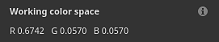

This section shows the final color value given the current working color space.

Hovering the **Working color space** title with the mouse allows to display the name of the current color space.

>[!NOTE]
>
> This section is only available when [color management](../../help/features/color-management/color-management.md) is enabled.

## Swatches

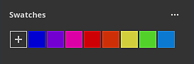

Color swatches offer a way to save colors so they can be reused at a later point. Swatches are available across projection and sessions.

### <b>Add swatch</b>

Clicking on this button will create a new swatch color in the current set.

The swatch color is created only if the last color (the one next to the button) is different to the color currently edited.

>[!NOTE]
>
> Swatch color are managed and saved as sRGB colors, whatever the current [color management](../../help/features/color-management/color-management.md) configuration is set to.

### <b>Swatch color</b>

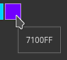

Click on a swatch color to load it.

Hovering the swatch will display its hexadecimal value.

>[!NOTE]
>
> When [color management](../../help/features/color-management/color-management.md) is enabled, the display of the colors is adjusted based on the currently selected Display.

### <b>Swatch settings</b>

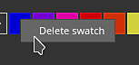

Right-click on a swatch color open the menu and delete it.

### <b>Settings menu</b>

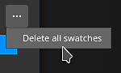

Use the settings menu to delete all the swatches.

>[!NOTE]
>
> Swatches are saved inside a configuration file available in the user's documents folder. For more information see the [Shelf and Assets location](../../help/pipeline-and-integration/resource-management/shelf-and-assets-location/shelf-and-assets-location.md) page.
