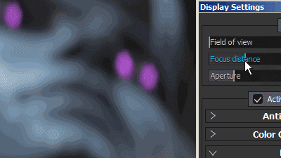
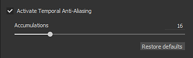
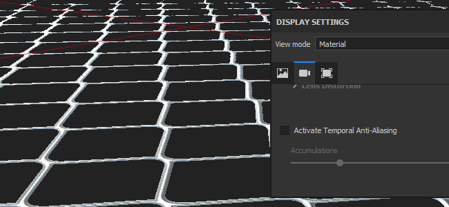
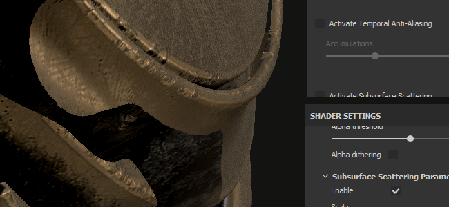
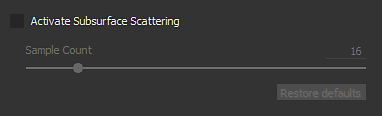
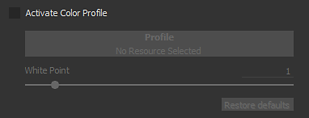
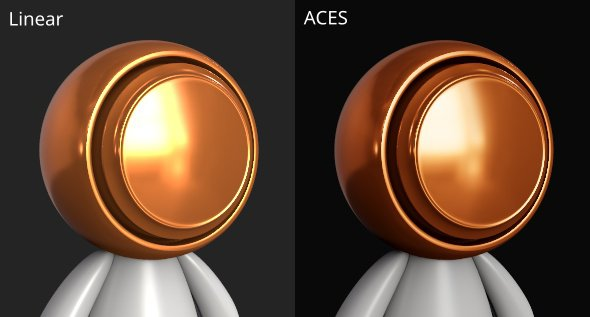

# Camera settings

This section of the **Display Settings** controls the behavior of the camera as well as the final look of the viewport.

## Camera

| *Setting* | *Description* |
| --- | --- |
| **Field of View** | Allows to control the Filed of View of the camera (in degrees) |
| **Focus Distance** | Defines the distance at which the focus point is located.  This point is used by the Depth of Field effect. 

 **Note:**  The Focus Distance can be set automatically by clicking on a point of the mesh with the shortcut **CTRL + Middle Mouse Button** |
| **Aperture** | Defines how wide the Depth of Field will be. 

 **Note:**  If Iray is controlling this parameter, changing it will re-trigger a computation. |

## Post effects

See the [Post-Effect page](../../../features/post-processing/post-processing.md) for more information.

## Temporal anti-aliasing

When enabled the **Temporal Anti-Aliasing** (**TAA**) will remove jagged edges in the viewport.   
**TAA** works by accumulating information across multiple frames of rendering, this means the effect is disabled until the camera stops moving or other operation are performed.

| *Setting* | *Description* |
| --- | --- |
| **Accumulations** | Defines how many frames will be accumulated to reduce the aliasing.<ul data-preserve-html="true"> <li data-preserve-html="true">16: Recommend value for most cases</li> <li data-preserve-html="true">64: Useful for cleaning out high contrast values (such as Alpha Test shader and dithering combined)</li> </ul>  **Note:**  This setting doesn't have any impact on performance; however, a high value may take longer to produce good results. |

{width="500px"}

The Anti-Aliasing can also be used to filter the **Alpha-Test** shader if the setting "**Alpha Dithering**" is enabled:

{width="500px"}

## Subsurface scattering

See the [Subsurface Scattering](../../../features/subsurface-scattering/subsurface-scattering.md) page for more information.

## Color profile

See the [Color Profile page](../../../features/post-processing/color-profile/color-profile.md) for more information.

## Tone mapping

| Setting | Description |
| --- | --- |
| **Function** | Specify the function used to fit color values exceeding the monitor display capabilities (remapping of HDR values to a LDR range).Possible values are:<ul data-preserve-html="true"><li data-preserve-html="true"><strong>Linear</strong> (default): no transformation, values above 1.0 are clamped.</li><li data-preserve-html="true"><strong>ACES</strong>: use the ACES Filmic tone mapping curve.</li></ul> 

 **Note:**  Some Game Engines and Rendering software use the ACES tone mapper. Enabling this function will help matching colors between applications and avoid differences. |
