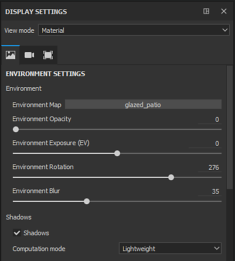
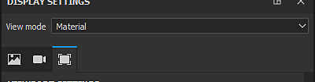

# Display settings

{width="320px"}

The **Display Settings** window regroups the environment, camera and viewport settings. These settings are global to the project and can affect the look of the viewport.

## View mode

The view mode controls how the viewport will look. The dropdown is divided into three sections:

| Section | Description |
| --- | --- |
| **Lighting** | Display the 3D model in the viewport with full lighting, including shadows if enabled. |
| **Single channel** | Also called solo mode. Display the mesh in the viewport with only a specific channel or texture without lighting. |
| **Mesh maps** | Display the mesh in the viewport only with a specific baked textures without lighting. |

>[!NOTE]
>
> The view mode can also be changed by using the <b>dropdown</b> available in the corners of the [viewports](../../interface/viewport/viewport.md). There are also [shortcuts](../../interface/settings/shortcuts/shortcuts.md) available to quickly cycle between channels, mesh maps and even go back to the material mode.

## Display Settings sections

For more details about each section see the dedicated page :

* [Environment settings](../../interface/display-settings/environment-settings/environment-settings.md)
* [Camera settings](../../interface/display-settings/camera-settings/camera-settings.md)
* [Viewport settings](../../interface/display-settings/viewport-settings/viewport-settings.md)
