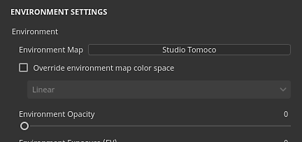

# Environment settings

This section of the  **Display Settings**  controls the lighting in the viewport.

## Environment

| *Setting* | *Description* |
| --- | --- |
| **Environment Map** | Environment map texture to be used to light the scene. Can be found in the [Assets](../../assets/assets.md) window by using the "Environment" preset.Click on the button to open a mini-shelf and choose a different environment map. |
| **Override environment map color space** | If the current project use [Color management](../../../features/color-management/color-management.md), this setting can be enabled to override the color space of the environment map. |
| **Environment Opacity** | Controls the visibility/opacity of the environment textures in the background of the viewport. This settings has no impact on the lighting of the scene. |
| **Environment Exposure** | The exposure value (EV) is a number that represents a fixed scene luminance. This setting allows to offset the default luminance value.This setting should stay on 0 when working with the environment maps provided with the application. Texturing an asset with an incorrect exposure value could lead to color calibration issues in other applications. |
| **Environment Rotation** | Controls the horizontal rotation of the environment texture. Useful for rotating the lighting in the scene and change how the object react. Can be controlled with a [ shortcut](../../settings/shortcuts/shortcuts.md). |
| **Environment Blur** | Controls how sharp or blurry the environment texture will appear in the background of the viewport. This settings has no impact on the lighting. |
| **Environment Alignment** | Controls how the environment texture rotate around the 3D mode inside the viewport. This setting can be used to light up areas under the 3D model when set to local.Possible values:<ul data-preserve-html="true"><li data-preserve-html="true"><strong>World</strong> (default): the environment is aligned with the scene and rotate around the up axis of the 3D model.</li><li data-preserve-html="true"><strong>Local</strong>: the environment is aligned to the camera and rotate around the up axis of the camera.</li></ul> |

## Shadows

| *Setting* | *Description* |
| --- | --- |
| **Shadows** | Enable / Disable rendering of shadows in the viewport. |
| **Computation mode** | Controls how quickly the shadows are computed.<ul data-preserve-html="true"><li data-preserve-html="true"><strong> Intensive </strong> : Compute fast but can froze the rendering of the viewport.</li><li data-preserve-html="true"><strong> Average </strong> : Average of the Intensive and Lightweight mode.</li><li data-preserve-html="true"><strong> Lightweight </strong> : (default) Compute slowy the shadows over a few seconds but doesn't slow down viewport performances.</li></ul> |
| **Shadows opacity** | Controls how much Shadows will be visible in the scene. |
