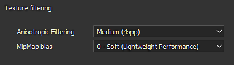
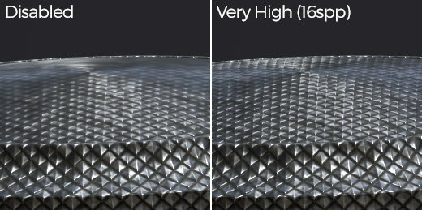
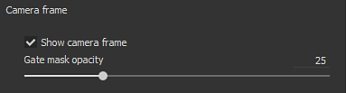
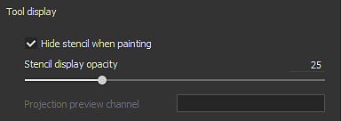
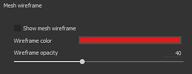
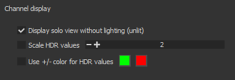
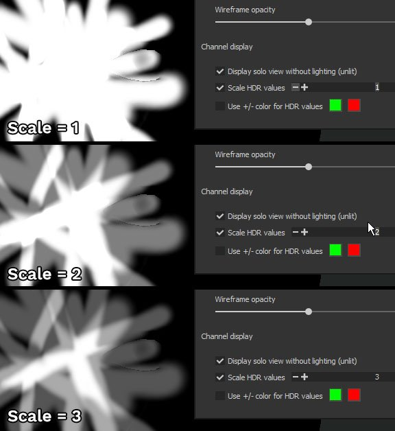
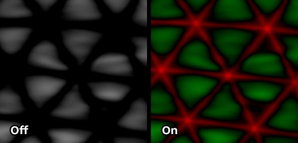
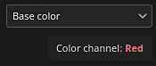

# Viewport settings

This section of the **Display Settings** controls various settings related to the display of the viewport such as the texture filtering and the mesh wireframe.

## Texture filtering

The Anisotropic Filtering and MipMap Bias allow to control the display of textures in the viewport. These settings don't affect the textures directly and won't be applied at export, they just refine the rendering process in the viewport. The MipMap Bias setting allows to force to use very sharp textures for pixels that are far away or at oblique angles, however in some cases they can create Moiré patterns or jittering.

Default settings are a compromise of quality and performances and should only be changed when really needed.

| *Setting* | *Description* |
| --- | --- |
| **Anisotropic Filtering** | Anisotropic Filtering improves the texture quality when viewing at oblique angles. High quality values provide a better filtering but can result in a loss of performances. This setting controls the amount of samples per pixel (spp) used for the filtering :<ul data-preserve-html="true"><li data-preserve-html="true"><strong>Disabled</strong> : No filtering</li><li data-preserve-html="true"><strong>Low</strong> (2spp)</li><li data-preserve-html="true"><strong>Medium</strong> (4spp) : Default value</li><li data-preserve-html="true"><strong>High</strong> (8spp)</li><li data-preserve-html="true"><strong>Very High</strong> (16spp)</li></ul> 

 |
| **MipMap bias** | Offset the MipMap level of detail to improve the texture quality. Sharp values can result in loss of performances and jagged textures.<ul data-preserve-html="true"><li data-preserve-html="true"><strong>0 - Soft</strong> (Lightweight Performance) : Default value</li><li data-preserve-html="true"><strong>1 - Medium Soft</strong></li><li data-preserve-html="true"><strong>2 - Sharp</strong></li><li data-preserve-html="true"><strong>3 - Very Sharp</strong> (Intensive Performance)</li></ul>(From 0 to -3) |

## Camera frame

For more information regarding Camera Management see : [Camera management](../../viewport/camera-management/camera-management.md)

## Tool display

| *Setting* | *Description* |
| --- | --- |
| **Hide stencil when painting** | When using a stencil (see the paint tool properties), this setting allows to hide it temporarily when painting on the mesh. |
| **Stencil display opacity** | Controls the visibility of the stencil over the viewport rendering when not painting. |
| **Projection preview channel** | Controls which channel of the material to display when using the projection tool. |

## Mesh wireframe

| *Setting* | *Description* |
| --- | --- |
| **Show mesh wireframe** | Enable or disable the display of the mesh wireframe in the viewport. |
| **Wireframe color** | Controls the color used to draw the mesh wireframe. |
| **Wireframe opacity** | Controls how much the wireframe will be visible when drawn on top of the mesh. |

## Channel display

>[!NOTE]
>
> The channel display settings are only available when using the **single channel** view mode.

| *Setting* | *Description* |
| --- | --- |
| **Display solo view without lighting (unlit)** | When viewing in single channel mode, enabling this setting will remove the lighting and display the channel as flat colors. If disabled, a shadowing will be applied to the border of the mesh. |
| **Scale HDR values** | When viewing in single channel mode an **HDR** texture (such as the height) this setting will scale the total values. This is useful for viewing values that go over 1 or below -1. The result equals **Channel dived by scale**.With the example below, the height channel has values up to 3. However by default they cannot be viewed unless the scale value is changed : 

 |
| **Use +/- color for HDR values** | This setting allows to view more easily HDR texture by replacing positive values by the first color and negative values by the second color. Neutral values (0) are black.Example : 

 |
| **Color channels** | Modify the viewport viewmode to only display individually the R, G, B or Alpha component of the current channel. This setting is not available in Material display mode. When enabled, the name of the selected color channel is displayed in the viewport:  

  Possible values:<ul data-preserve-html="true"><li data-preserve-html="true"><strong>RGBA</strong> (default): on Color channels, display all the components with the transparency.</li><li data-preserve-html="true"><strong>Grayscale+Alpha</strong> (default): on Grayscale channel, display the grayscale values with the transparency.</li><li data-preserve-html="true"><strong>R</strong>: on Color channels, only display the Red component.</li><li data-preserve-html="true"><strong>G</strong>: on Color channels, only display the Green component.</li><li data-preserve-html="true"><strong>B</strong>: on Color channels, only display the Blue component.</li><li data-preserve-html="true"><strong>Alpha</strong>: on any channels, only display the transparency of the texture.</li></ul> |

## Grid

The grid settings allow to display and control the drawing of a 3D grid inside the 3D viewport.

The grid divisions are automatic based on the current camera level of zoom and angle. The current grid unit is displayed in the bottom left of the viewport.

| Setting | Description |
| --- | --- |
| **Show grid** | If enabled, make the grid visible in the 3D viewport. |
| **Axis** | Define along which axis the grid is visible in the viewport. Default value is Y since this is the up axis of the application. |
| **Grid color** | The color of the grid when drawn in the viewport. |
| **Grid opacity** | The opacity of the grid in the viewport. |
