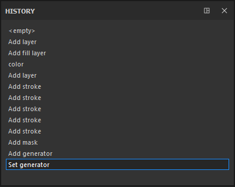

# History

  
The History window lists all the actions and modifications that have been made in the currently open project.

* Each element of the list can be clicked to go back to the state of the project when the action was created/applied.
* Creating a new action when not being on the last element of the list will erase existing future actions and replace them with a new one instead.
* The actions are global to the project, so creating a layer in two different texture sets will appear in the same list.

While all the information is saved in a project (to be able to re-paint/re-texture everything), the History list will not be accessible if the project is closed and reopened. The history list is only available during the current session.
