# Blending modes

Layers and effects have access to many **Blending Modes**. They allow to mix the result of a layer with the other layers below in different manners.

Not all the Blending Modes are suited for all use cases. For example the **Normal map** Blending Modes are only useful for the **Normal channel** in a Texture Set.

## Blending Mode Order

To understand how and when a Blending Mode is applied, it is important to understand the order in which operations are performed in the **Layer Stack**:

1. The Layer at the Bottom is computed.
1. The Layer at the Top is computed and mixed with the layer below based on the Blending Mode (example: Multiply).
1. The Mask is applied to give the final look at the Top layer.

## Changing The Blending Mode

The Blending Mode can be changed for  **each channel**  in a layer. To switch between the channels use the top-left dropdown available in the layer stack window.

To change the blending mode simply click on the Blending Mode dropdown on a specific layer:

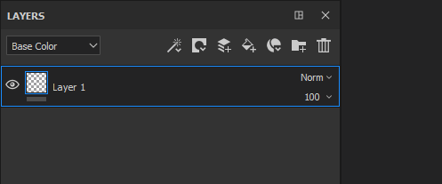

>[!NOTE]
>
> It is possible to quickly switch between Blending Modes with the following shortcuts if the dropdown has the focus:
> 
> * Arrow Up or Down keyboard shortcuts
> * Mouse Wheel Up or Down

## List of Blending Modes

Below is the list of all the Blending Modes available in Substance 3D Painter layers and effects. Most Blending Modes work via operations in RGB (or in Grayscale) but some operations are also performed via a different mode which is  [HSV (Hue, Saturation, Value)](https://en.wikipedia.org/wiki/HSL_and_HSV). All Blending Modes are performed in **Linear Gamma space** internally.

| *Name* | *Description* |
| --- | --- |
| Normal | Displays the Top layer over the Bottom layer without transformation (copy mode). If the Top layer has transparency (alpha) it will display the Bottom layer through the transparent pixels. 
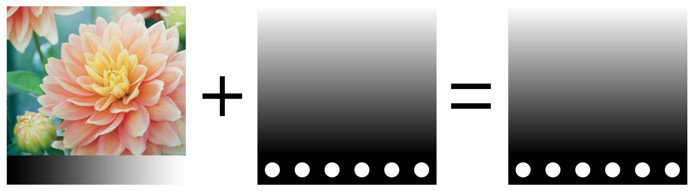
 |
| Passthrough | Flattens the Bottom layer into the Top layer. Mostly useful in the following cases :<ul data-preserve-html="true"><li data-preserve-html="true">To apply an [effect](../../../features/effects/effects.md) on all the layers below the Top layer</li><li data-preserve-html="true">To [Smudge or Clone](../../../painting/tool-list/tool-list.md) the layers below the Top layer</li></ul> 
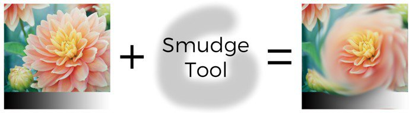
 **Note:**  **Effects**  can be  **drag and dropped**  directly into the layer stack, doing so will create a layer with the Blending Mode set to PassThrough for all its channels. |
| Disable | Discards the blending of the layer, displaying only the previous layers. It can be used to optimize the computation of a channel by ignoring it in the Top layer. 
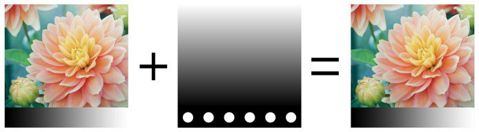
 |
| Replace | Overwrites the Bottom layer. This is useful for example to avoid blending information with the layers below. Replace works differently from the Normal blending because it will also ignore the alpha present in the Top layer, which could result is Transparent pixels. 
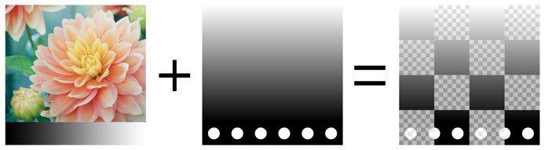
 |
|  |  |
| Multiply | Multiplies the Top layer over the Bottom layer. The result will always be a darker color. 
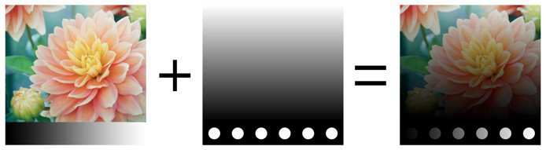
 |
| Divide | Divides the layers below by the color information of the current layer. The result image is most of the time lighter and sometimes can look burned out. 
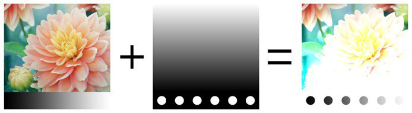
 |
| Inverse Divide | Identical to the Divide blending mode but the Top and Bottom layer are exchanged in the blending operation. 
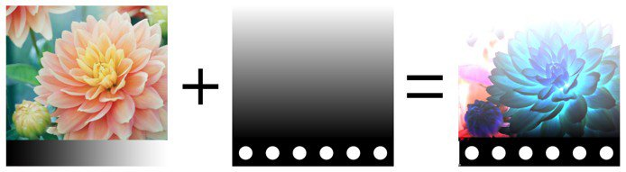
 |
| Darken (Min) | Keeps the minimum color value between the Top layer and the Bottom layer. 
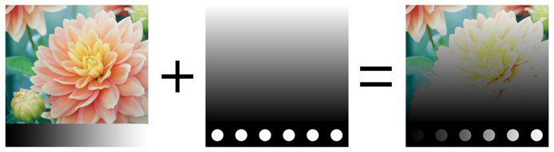
 |
| Lighten (Max) | Keeps the maximum color value between the Top layer and the Bottom layer. 
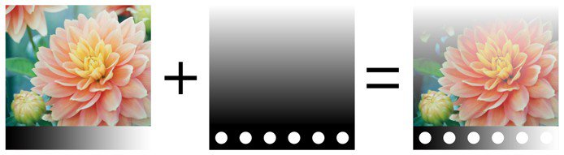
 |
|  |  |
| Linear Dodge (Add) | Adds the Top layer color value to the Bottom layer. The result can give colors that are below 0 or higher than 1, in which case the result will be clamped/clipped if the channel is not HDR. This Blending Mode is useful to accumulate height information for example. 
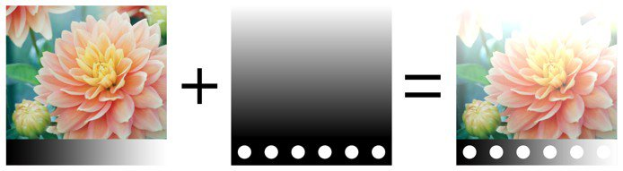
 |
| Subtract | Subtracts the Top layer Color from the Bottom layer. The result can give colors that are below 0, in which case the result will be clamped/clipped if the channel is not HDR. 
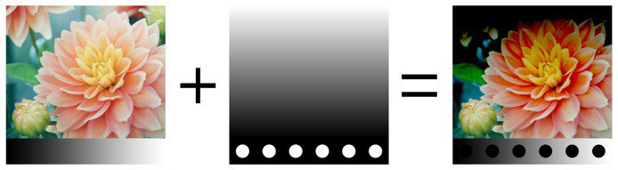
 |
| Inverse Subtract | Identical to the Subtract Blending Mode but the Top and Bottom layer are exchanged in the blending operation. 
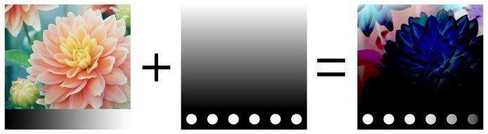
 |
| Difference | Subtracts the Top layer Color from the Bottom Layer, but take the absolute value of the result (negative values will become positive). 
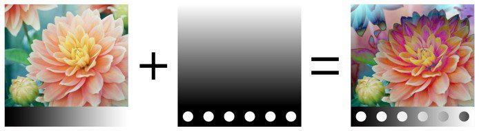
 |
| Exclusion | Similar to the Difference blending mode but it will produce a result with a lower contrast. 
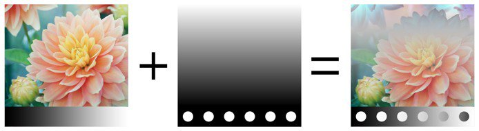
 |
| Signed Addition (AddSub) | Both Adds and Subtracts Color information from the Bottom layer based on the Top layer colors. Grayscale values have no effect, while darker colors will subtract information and lighter colors will add information. 
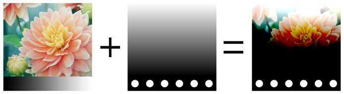
 |
|  |  |
| Overlay | Combine both the Screen and Multiply Blending Modes. Grayscale values in the Top layer will have no effect, but dark colors will Multiply colors while bright colors will lighten the colors. 
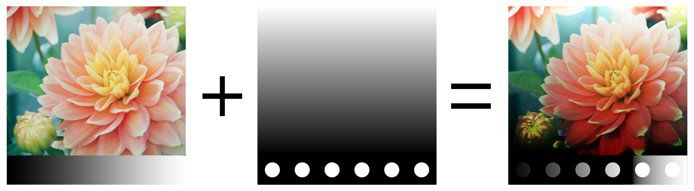
 |
| Screen | Color information from the Top and Bottom layer are inverted then multiplied against each other, this result is then inverted again. This produce a visual result that is the opposite of the Multiply blending mode and gives a brighter image. 
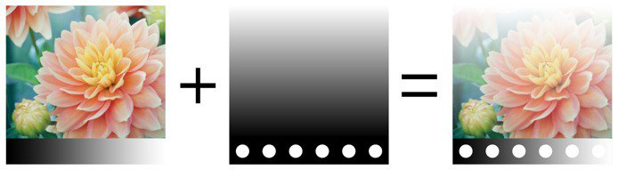
 |
| Linear Burn | Adds the Top and Bottom layer Color information together and then subtract 1 from the result. 
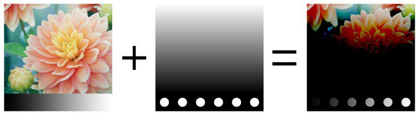
 |
| Color Burn | Divides the Bottom layer by the Top layer. The Bottom layer is inverted before the operation is performed. This blending operation darkens the Top layer and increase its contrast to show the colors of the Bottom layer. The darker the Bottom layer is, the more of its color is used. 
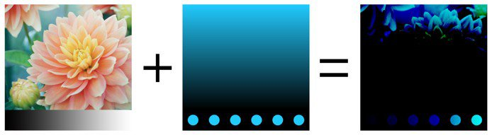
 |
| Color Dodge | Divides the Bottom Layer by the inverted Top layer. This operation lightens the Bottom layer depending on the value of the Top layer. The brighter the Top layer is, the more its colors affect the Bottom layer. 
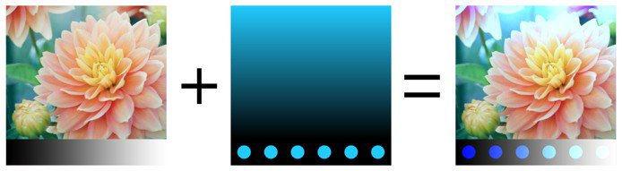
 |
|  |  |
| Soft Light | Similar to the Overlay Blending Mode, but applied with a different curve to blend the Color information which result in a less contrasted image. 
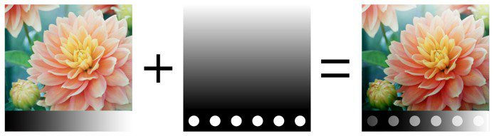
 |
| Hard Light | Similar to the Overlay Blending Mode (combine both the Multiply and Screen operations). The difference is that the order of operation is inverted which result in an image with darker or brighter colors but with less contrast . 
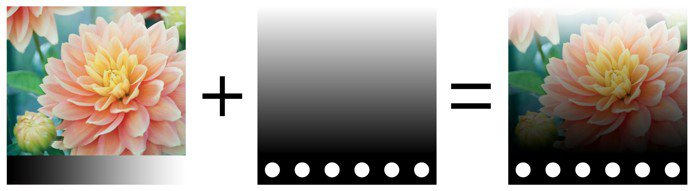
 |
| Vivid Light | Combines Color Dodge and Color Burn blending modes. Dodging is applied to colors that are lighter than gray and burning is applied to colors that are darker than gray. Gray values are unaffected. The result is a more contrasted image. 
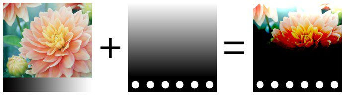
 |
| Linear Light | Combines Linear Dodge and Linear Burn. Dodging is applied to colors that are lighter than gray and burning is applied to colors that are darker than gray. Gray values are unaffected. The result is similar to Vivid Light but with less contrast. 

 |
| Pin Light | Lightens and darkens color information based on the Top layer colors. If the dark colors on the Top layer are darker than the colors on the Bottom layer they will be visible, if they aren’t they will drop away. Same principle applies for bright colors. This blend mode can result in patches or blotches (large noise), and it completely removes all mid-tones. 
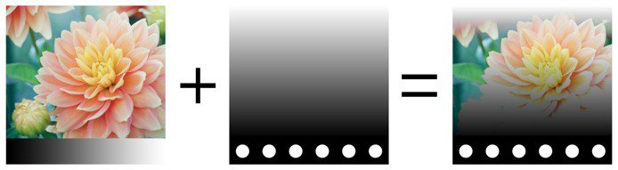
 |
|  |  |
| Tint | Performs the operation with the HSV model. Keeps only the Hue of the Top Layer and uses the Saturation and Value of the Bottom Layer. Black and very dark colors don't have any Hue, therefore colors of the Bottom layer will remain unchanged. 
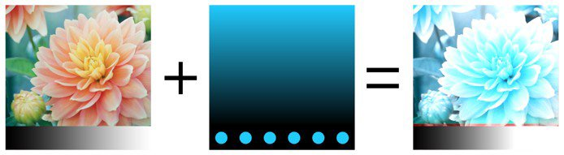
 |
| Saturation | Performs the operation with the HSV model. Keeps only the Saturation of the Top Layer and uses the Hue and Value of the Bottom Layer. Black and very dark colors are desaturated, therefore colors of the Bottom layer will become grayscale values. 
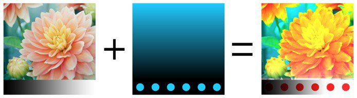
 |
| Color | Performs the operation with the HSV model. Keeps only the Hue and Saturation of the Top Layer and uses the Value of the Bottom Layer. Black and very dark colors don't have any Hue and are desaturated, therefore colors of the Bottom layer will become grayscale values. 
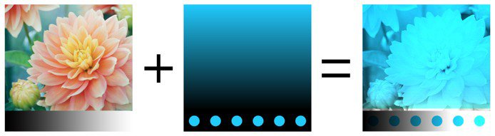
 |
| Value | Performs the operation with the HSV model. Keeps only the Value of the Top Layer and uses the Hue and Saturation of the Bottom Layer. 
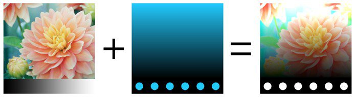
 |
|  |  |
| Normal Map Combine | Whiteout Blending operation. Preserve details while making sure flat normals still operate properly. See [ Normal Map Painting ](../../../painting/advanced-channel-painting/normal-map-painting/normal-map-painting.md) for more information. 
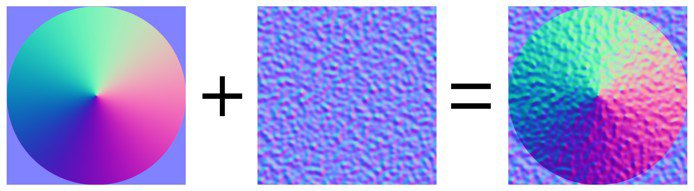
 |
| Normal Map Detail | Detail Oriented Blending operation (Reoriented Normal Mapping), more precise than Normal Map Combine. Preserve flat normal maps and the intensity of the two sources. To ensure that result the Top layer normal is reoriented to follow the surface of the bottom layer. See [ Normal Map Painting ](../../../painting/advanced-channel-painting/normal-map-painting/normal-map-painting.md) for more information. 
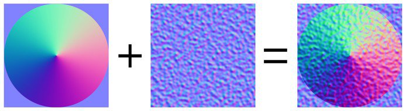
 |
| Normal Map Inverse Detail | Same behavior as for the Normal Map Detail blending operation, however it is the Bottom layer that is transformed to fit the surface of the Top layer. See [ Normal Map Painting ](../../../painting/advanced-channel-painting/normal-map-painting/normal-map-painting.md) for more information. 
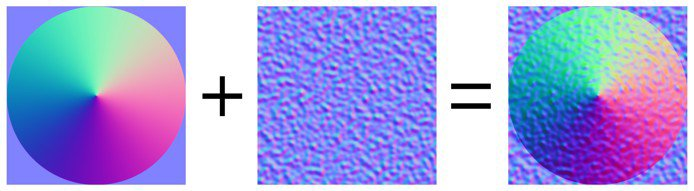
 |

>
