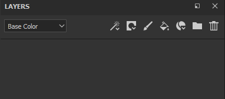
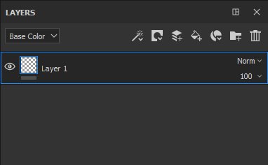
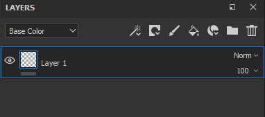
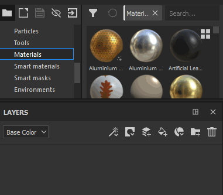
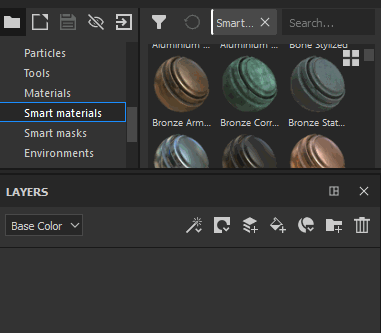
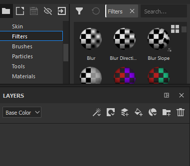

# Creating layers

There are multiple ways of adding/creating layers in the Layer Stack :

| *Action* | *Demonstration* |
| --- | --- |
| Create a **paint layer** by clicking on the dedicated button 

 | 

 |
| Create a **fill layer** by clicking on the dedicated button 

 | 

 |
| Create a **folder** by clicking on the dedicated button 

 | 

 |
| **Duplicate** a layer by using one of the following method :<ul data-preserve-html="true"><li data-preserve-html="true">Right-click &gt; Duplicate</li><li data-preserve-html="true">Shortcut CTRL+D or COMMAND+D</li><li data-preserve-html="true">Press and maintain CTRL or COMMAND and drag and drop the layer(s)</li></ul> | 

 |
| Delete a layer by clicking on the dedicated button 

 | 

 |

>[!NOTE]
>
> Some of these actions have an associated keyboard shortcut which can be consulted on the [dedicated page](../../../help/interface/settings/shortcuts/shortcuts.md).

Drag and dropping resources from the shelf can be a way of creating layers as well :

| *Action* | *Demonstration* |
| --- | --- |
| Drag and Drop a **Material** from the [Assets](../../../help/interface/assets/assets.md) into the Layer Stack | 

 |
| Drag and Drop a **Smart Material** from the [Assets](../../../help/interface/assets/assets.md) into the Layer Stack | 

 |
| Drag and Drop a **Effects** from the [Assets](../../../help/interface/assets/assets.md) into the Layer Stack | 

 |
