# Geometry mask

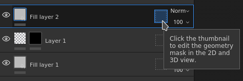   
The Geometry mask is a secondary mask on layers that allows to mask a layer based on the 3D model geometry of the associated Texture Set. It can mask by mesh names or by UV Tiles.

## Overview

The Geometry mask works by specifying on which part of the 3D Model the layer should apply via a include/exclude list.

The Geometry mask is an useful tool to quickly discard big part of the 3D model geometry. It offers several advantages to the paint mask:

* It is usually faster to setup and use with viewport selection modes.
* It offers better performances as geometry can be completely discarded when generating the textures.
* It is non-destructive and will be updated when the 3D model change after a re-import.
* It allows to paint geometry that is underneath masked geometry, allowing to paint hidden parts.
* Like paint mask, the geometry mask can be applied on a group to affect multiple layers at once.

### Icon states

The geometry mask icon can indicates in which state it is:

| Icon | Description |
| --- | --- |
| 
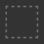
 | No geometry has been excluded, the layer is applied on the whole mesh of the associated Texture Set.This is the default state of any new layer or folder. |
| 
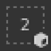
 | One or more mesh names have been excluded. The numbed indicates the amount of remaining elements still being affected by the layer. |
| 
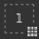
 | One or more UV Tiles have been excluded. The numbed indicates the amount of remaining elements still being affected by the layer. |
| 
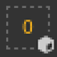
 | No mesh names are included, the layer won't have any actual effect. |

## Editing the Geometry mask

To modify the Geometry mask of a given layer, simply click on the dedicated icon. To exit the editing mode, simply click on another part of the layer such as the content or the paint mask:

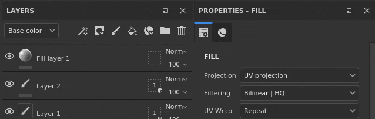

### Masking types

The geometry mask support two types of masking:

| Type | Description |
| --- | --- |
| **UV Tiles** | Masking is done by specifying which UV Tile (UDIM) number should be included. This is the most performant method has it allows to discard fully a texture from being computed. |
| **Mesh names** | Masking is done by specifying which sub-mesh should be included in the 3D Model. The geometry is grouped by mesh name. |

### Layer stack actions

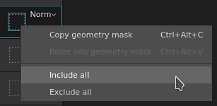

The Geometry mask state can be quickly modified from the layer stack directly by right-clicking on the icon.

It offers the following actions:

| Action | Description |
| --- | --- |
| **Copy geometry mask** | Copy the type and selection of the Geometry mask of the given layer. |
| **Paste into geometry mask.** | Paste the previously copied Geometry mask properties. |
| **Include all** | Mark all the elements of the given mask as selected. |
| **Exclude all** | Mark all the elements of the given mask as deselected. |

## Painting through masked geometry

When parts of the geometry have been excluded, then can be hidden in the viewport. This allows to paint on the geometry that was previously underneath and unaccessible.

To hide the excluded geometry, use the button at the top of the viewport in the contextual toolbar:

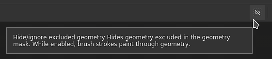

In the example below, the 3D model has been split in two objects: a top and bottom part. By default brush strokes collide with all the objects. by excluding the top part it is now possible to only paint on the bottom part exclusively.

>[!NOTE]
>
> The geometry mask include/exclude list is dynamic, changing its state will trigger a new computation of the brush strokes in the layer. This allows to adjust the masking without losing the brush strokes when re-importing a mesh with new UV tiles or if the mesh names have changed. However it also means that brush strokes are not baked, so any change in the geometry mask could lead to incorrect brush projection afterward.

| Visual | Description |
| --- | --- |
| 
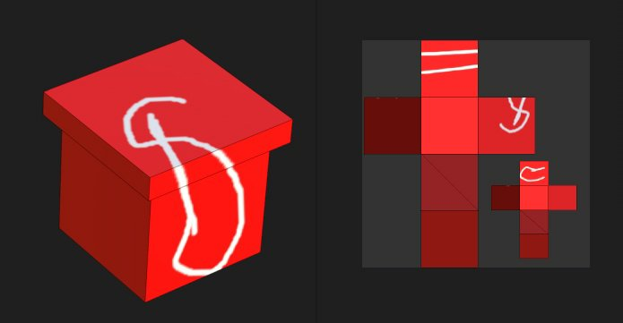
 | No geometry has been excluded in the Geometry mask, the paint layer on which the white brush stroke has been done collides will all the geometry.The **Hide excluded geometry** button is disabled. |
| 
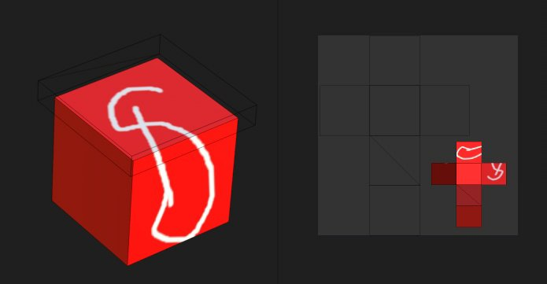
 | The top part has been excluded in the geometry mask and the white brush stroke only collides with the bottom part of the geometry.The **Hide excluded geometry** button is enabled. |
| 
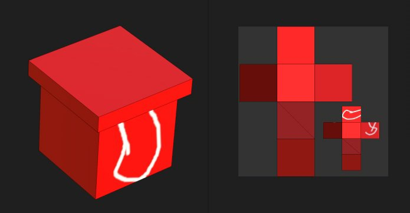
 | The top part has been excluded in the geometry mask and the white brush stroke only collides with the bottom part of the geometry.The **Hide excluded geometry** button is disabled. |
