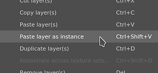
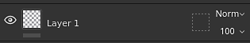
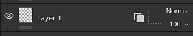
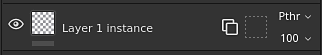
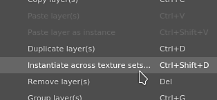
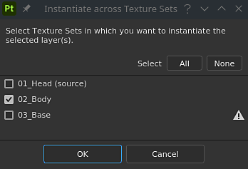
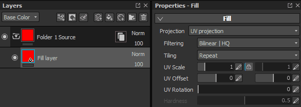
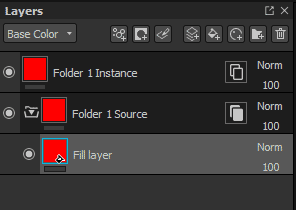

# Layer instancing

**Layer instancing** allows to synchronize layer parameters across multiple layers and [Texture Sets](../../../interface/texture-set/texture-set.md) while still being able to generate a mesh dependent result.

When a layer instance is created, the original layer (or source layer) is used to replicate parameters across all the existing instances. **Only the source layer can be modified**.

>[!WARNING]
>
> Any paint actions (brush strokes, polygon fill, etc.) will only work on the Texture Set where the source layer is located. Other Texture Sets that have an instance of this layer will simply discard the paint actions.

## Creating a layer instance

To create a layer instance:

1. Select any existing layer
1. Copy the layer (**CTRL+C**)
1. Paste it as an instance (use **CTRL+SHIFT+V** or right-click to open the context menu and choose **Paste as instance**)

>[!NOTE]
>
> Instances can be created from any layer including **groups**. Instancing a folder can be an easy way to replicate multiple layers across various Texture Sets. Adding layers inside an instance folder will also replicate them into existing instances.

Once an instance has been created, the source and target layer will display a new icon. This icon is a button that can be used to navigate between a source layer and its instances more easily, without having to manually switch between Texture Sets (see below).

| Name | Icon |
| --- | --- |
| **Non-instanced layer** | 

 |
| **Instance Source** | 

 |
| **Instance Target** | 

 |

## Creating an instance across Texture Sets

It is possible to create a layer instance on multiple Texture Sets in one action, avoiding to copy/paste it manually.

To create an instance across multiple Texture Sets:

1. Select any existing layer
1. Right-click on the layer to open the context menu
1. Choose **Instantiate across texture sets**
1. In the new window, check which Texture Sets needs to receive an instance.
1. Click OK to validate and create the instances.

<table>
<tr style="border: 0;">
<td style="border: 0;" valign="top">

</td>
<td style="border: 0;" valign="top">

</td>
</tr>
</table>

>[!NOTE]
>
> The exclamation point next to a Texture Set name indicates a channel  **mismatch**. It means that if an instance is created in this Texture Sets, it will not render correctly because a channel is missing.

## Switching between an instance and its source

Since an instance can  **only**  be updated by  **editing the source**  (because of technical reasons), it is mandatory to select the source layer to edit its properties.   
This can be done by clicking on the  **instance properties button**  on the layer in the layer stack.

When clicking on an instance properties button, it will switch the  **properties window**  from the current tool/layer to  **a list**  displaying a source layer and its instances.   
Clicking on  **any element**  of the list to automatically  **jump to this layer**  . This will automatically  **change**  the current  **Texture sets selected**  to the right one as well.

Using the  **instance tree**  list is the best way to  **quickly**  go from an instance to its source while seeing the  **dependencies**  at the same time.

## Instance cycles (and how to solve them)

Cycles are instances that are used into the source layer itself either directly or indirectly. Cycles  **cannot be computed**  by the Substance 3D Painter engine and therefor require to be  **disabled**  until fixed or removed.

Example:   
 

In this example, the instance of the source layer is moved inside it (because it is a folder). The instance becomes broken because in order to generate its parameters we need to query the parameters from the source, which depends of the parameters from the instance. This create a cycle that cannot be solved automatically. The instance becomes disabled.

The only way to fix a cycle is to either  **move**  the instance outside the folder or to  **delete**  it.

Layer instances can be used in source layers as long as the the instance itself refer to a different source layer.
