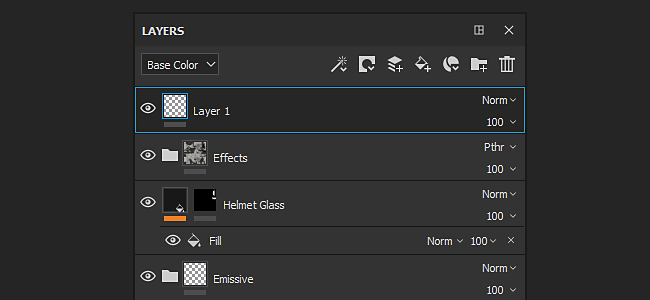
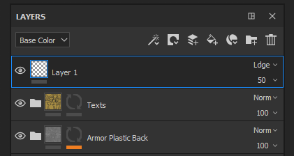
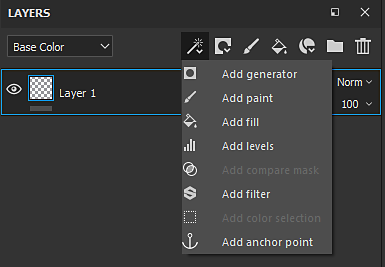
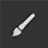

# Layer stack

The **Layer Stack** lets you manipulate the layers of a Texture Set. A layer contains the painting and effects that will create the texture on the 3D object in the scene. You can hide and unhide layers, put them into folders and change their opacity and blending mode.

See the following pages for additional information :

* [Creating layers](../../interface/layer-stack/creating-layers/creating-layers.md)
* [Managing layers](../../interface/layer-stack/managing-layers/managing-layers.md)
* [Masking and effects](../../interface/layer-stack/masking-and-effects/masking-and-effects.md)
* [Blending modes](../../interface/layer-stack/blending-modes/blending-modes.md)
* [Layer instancing](../../interface/layer-stack/layer-instancing/layer-instancing.md)
* [Geometry mask](../../interface/layer-stack/geometry-mask/geometry-mask.md)

## Overview

The layer stack display layers with a specific hierarchy : the layer at the bottom will be drawn first on the mesh, the layer on top will follow. Therefore the layer at the top of the stack is the last item, while the layer at the far bottom is the first one. Same principle applies to folders, however the content of the folder takes priority. This means the content of a folder will be processed before the layers that are at the same level.

**Common characteristics :**

* Each layer is **multi-channels**.
* The paint tool will paint **on all of their respective channels** depending of the material settings (which channel you are currently viewing in the Layer Stack has no impact).
* Each Layer has a **blending mode** and an **opacity** per channel (you can switch between channels through the top left dropdown menu).

**Types of layers :**

* **Paint Layer** : This type of layer can be painted on with brushes and particles
* **Fill layer** : This layer cannot be painted on, instead you can load a material into it, to fill the channels. (You can also manipulate the transformation to repeat the material for example.)
* **Folder** : This type of layer has for only purpose to contains other layers, it is mainly used to organise the layer stack

On each layer you can **add a mask** which allow to apply the content only to a specific parts of the channels of the current texture set.   
You can either paint on the mask manually (in grayscale with a brush) or use filters and substances for more dynamic/procedural results.

## Viewmode

The top left dropdown of the Layer Stack controls the view mode of the layer stack. Since a layer can cover multiple channels, it is not possible to display all of these properties at once. Therefore the viewmode can be used to defined the current display context. When using this dropdown it is possible to specify which channels should be used to display in the layer thumbnails as well as controlling the blending mode and the opacity for this channel only.

The list in this dropdown is based on the list of channels available in the [Texture Set settings](../../interface/texture-set/texture-set-settings/texture-set-settings.md).

## Actions

The top right list of icons are the common actions that can be performed in the Layer Stack :

| Action | Description |
| --- | --- |
| Add Effect 

 | Create a new effect and add it to the currently selected layer. For more information about effects, see the[ dedicated pages](../../features/effects/effects.md). |
| Create Mask 

 | Open the Mask action menu which contains the following items :<ul data-preserve-html="true"><li data-preserve-html="true">Add white mask</li><li data-preserve-html="true">Add black mask</li><li data-preserve-html="true">Add bitmap mask</li><li data-preserve-html="true">Add mask with color selection</li><li data-preserve-html="true">Add mask with height combination</li></ul> |
| Create New Paint Layer 

 | Create a new Paint layer above the currently selected one. |
| Create New Fill Layer 

 | Create a new [Fill layer](../../painting/fill-projections/fill-projections.md) above the currently selected one. |
| Add New Smart Materials 

 | Insert a new Smart Material above the currently selected layer.Clicking on this button will open a mini-shelf to browse the list of Smart Materials available in the current [Assets](../../interface/assets/assets.md). |
| Add New Folder 

 | Create a new empty folder above the currently selected layer. |
| Delete Layer 

 | Delete the currently selected item (layer, folder or effect). |
