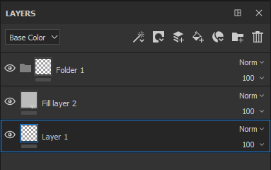
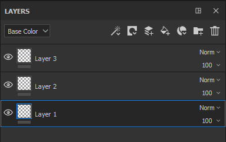
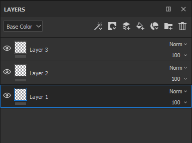

# Managing layers

Here are the possible manipulations inside the layer stack :

| *Action* | *Demonstration* |
| --- | --- |
| Click and drag to move a layer. When moving a layer, a bar can be visible which indicates where the layer will be put :<ul data-preserve-html="true"><li data-preserve-html="true"><strong>Bar above a layer</strong> : the layer will be put above the layer</li><li data-preserve-html="true"><strong>Bar between two layers</strong> : the layer will be put between the two layers</li><li data-preserve-html="true"><strong>Bar below a layer</strong> : the layer will be put below the layer</li></ul> | 

 |
| **Move into a folder** : click and drop a layer hover a folder to put it inside | 

 |
| **Multi-selection** : it can be done in two different ways :<ul data-preserve-html="true"><li data-preserve-html="true">Press and maintain the key Ctrl or Command</li><li data-preserve-html="true">Press the Shift key while by clicking on the first and last layer</li></ul> | 

 |
| **Grouping layers** : a folder can be created with the currently selected layer by one of the following actions :<ul data-preserve-html="true"><li data-preserve-html="true">Right-click &gt; Group Layers</li><li data-preserve-html="true">Pressing Ctrl+G or Command+G</li></ul> | 

 |
