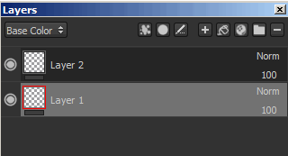
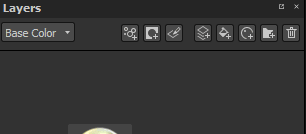
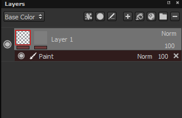
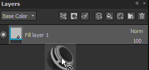
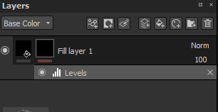
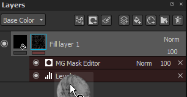

# Masking and effects

## Masking

Layers can be masked in order to display/apply their content only on specific parts of the texture. The mask works as an intensity parameter over the content of the layer. A mask on a layer is always in grayscale, no matter what content you use to paint over it (therefore any color will be converted to a grayscale value before being painted).

You can add a mask by using the right click menu or by using the dedicated button :

Possible operations on masks :

* You can visualize the mask itself doing **ALT + Left mouse click** on its thumbnail. It will switch the viewport to an isolated view of the mask from this layer. This operation is also available via the viewer settings.
* You can disable temporarily a mask doing **SHIFT + Left mouse click** on its thumbnail. Redo the same operation to enable it again. This operation is also available via the right-click menu ("toggle mask").
* You can copy the content of a mask to an other mask by doing **Right click &gt; Copy mask content** over the thumbnail and then doing **Right-click &gt; Paste into mask** on the thumbnail of the second mask.
* You can invert the background of the mask by doing **Right-click &gt; Invert mask background**. This is useful if you want to avoid destroying the effects attached to a mask.

>[!WARNING]
>
> Adding again a mask or removing it will destroy the mask and all the effects attached to it.

It is possible to immediately create a mask when creating a fill layer (via drag and drop) if the **CTRL** key is pressed :

## Effects

Effects are special operation that can be edited at any time. The effects are can be placed either on a mask of on the content of a layers.   
However so effects are more appropriate for on for the other. For example the "generators" are appropriate for the masks.

The line under each thumbnail on a layer indicate if effects exist. Grey equals no effects, red equals at least one effect. There is an effect stack is per mask and per content.

For more information, [see the dedicated page](../../../features/effects/effects.md).

## Smart Masks

The smart masks are a way to save a mask and its effect to easily re-use them on other layers or other projects. To create a smart mask, simply right click over a mask and choose "**Create smart mask**".  
When drag and dropping a smart mask onto a layer, a black mask will be created if it doesn't already exist, otherwise the effects list will be merged with the existing one. It is possible to overwrite completely the effect list by keeping "**CTRL**" pressed when dropping the smart mask.

<table>
<tr style="border: 0;">
<td style="border: 0;" valign="top">

</td>
<td style="border: 0;" valign="top">

</td>
</tr>
</table>
