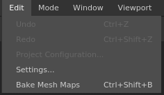

# Edit menu

   
The edit menu allows to access quickly the undo/redo actions but also to access the project settings and the global settings.

| Action | Description |
| --- | --- |
| **Undo** | Go one step back in the [ History ](../../history/history.md)stack. |
| **Redo** | Go one step forward in the [ History ](../../history/history.md)stack. |
| **Project configuration** | Open the [project settings](../../project-configuration/project-configuration.md) window of the current project. |
| **Settings** | Open the general [application settings](../../settings/settings.md) window. |
| **Bake Mesh maps** | Open the [Baking](../../../baking/baking.md) window. |
