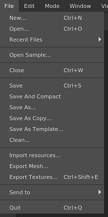

# File menu

{width="150px"}

The file menu contains the actions for creating and saving the projects and as well the actions for exporting and importing resources into a project.

| Action | Description |
| --- | --- |
| **New** | Open the new project creation window. See: [ Project Creation ](../../../getting-started/project-creation/project-creation.md)for more information. |
| **Open** | Open an existing project file on the disk. |
| **Recent files** | List all the projects recently opened. |
| **Open sample** | Open one of the sample projects provided with the application. |
| **Close** | Close the currently opened project. |
| **Save** | Save the current project in place. |
| **Save and compact** | Save the current project in place and compress it (reduce footprint on disk). |
| **Save as** | Save the current project under a new name and location. |
| **Save as copy** | Save the current project under a new name and location as a copy and keep the current project opened. |
| **Save as template** | Save the current project settings into a template file that can be used for a new project. |
| **Clean** | Remove any unused resources from the current project (will take effect after the next  **Save**). |
| **Import resources** | Open the import resources window. |
| **Export mesh** | Open the mesh export window that allows to export the current project as a 3D model file. |
| **Export textures** | Open the texture export window that allows to export the current project as bitmap textures. |
| **Send to** | List all the **Send To** actions to send a project to another application. |
| **Quit** | Close the application. If the current project has unsaved changes, it will prompt a message. |

>[!NOTE]
>
> Saving a project can be done in two manners:
> 
> * **Incremental**  : Default method, used when doing a regular save. Only the information that changed will be updated in the project file on the disk. This method allows to save very quickly the project without having to rewrite the project file entirely.
> * **Full / Compact**  : If a Clean operation is performed or if the project is saved with the action "Save And Compact", the method will rewrite the project on the disk entirely. This method allows to get rid of project fragmentation and reduce the footprint. See: [ Projects are really big](../../../technical-support/workflow-issues/project-issues/projects-are-really-big/projects-are-really-big.md).
