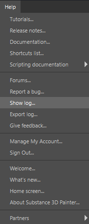

# Help menu

<table>
  <tr style="border: 0;">
    <td style="border: 0;" valign="top"></td>
    <td style="border: 0;" valign="top">The Help menu contains links and options for you to learn more about Substance 3D Painter. This includes helpful content like tutorials, release notes, and documentation, or places where you can solve problems with your local install of Painter ,including access to the logs or a way to report bugs.</td>
  </tr>
</table>

| Action | Description |
| --- | --- |
| Tutorials | Link to official [tutorials](https://helpx.adobe.com/substance-3d/unlisted/tutorials.html) related to the application. |
| Release notes | Link to the [release notes](../../release-notes/all-changes.md). |
| Documentation | Link to this documentation. |
| Shortcuts list | Link to the [shortcuts](../settings/shortcuts.md) documentation. |
| Scripting documentation | Link to the local documentation of the various scripting APIs. |
| Forums | Link to the [application forums](https://community.adobe.com/t5/substance-3d-painter/bd-p/substance-3d-painter). |
| Report a bug | Open the bug report window to send information. |
| Show log | Open the log file for your current Painter session in your default TXT file editor. |
| Export log | Export the log file, to ask for help with our support. |
| Give feedback | Link to our [feature request](https://feedback.substance3d.adobe.com/forums/261284-substance-3d-painter) platform. |
| Manage my account | Open [account.adobe.com](http://account.adobe.com) to manage your account and subscriptions. |
| Sign out | Sign out of the currently signed in Adobe account. |
| Welcome screen | Open the [welcome screen](../../getting-started/getting-started.md) window. |
| What’s new | Show the What’s new screen to learn more about changes in the current update. |
| Home screen | Open the Home screen. |
| Check for updates | Open the [update checker](../miscellaneous/update-checker.md) window. |
| About Substance 3D Painter | Open the About window which shows the application version, legal notices and other details. |
| Partners | Access information about partner software integrated into the Painter. |
