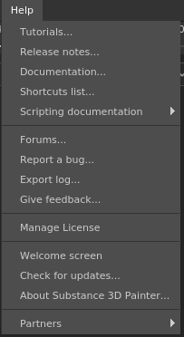

# Help menu

   
The help menu regroups various actions from links to the documentation to the about window.

| Action | Description |
| --- | --- |
| Tutorials | Link to official [tutorials](https://helpx.adobe.com/substance-3d/unlisted/tutorials.html) related to the application. |
| Release notes | Link to the [release notes](../../../release-notes/all-changes/all-changes.md). |
| Documentation | Link to this documentation. |
| Shortcut list | Link to the [shortcuts](../../settings/shortcuts/shortcuts.md) documentation. |
| Scripting documentation | Link to the local documentation of the various scripting APIs. |
| Forums | Link to the [application forums](https://community.adobe.com/t5/substance-3d-painter/bd-p/substance-3d-painter). |
| Report a bug | Open the bug report window to send information. |
| Export log | Export the log file, to ask for help with our support. |
| Give feedback | Link to our [feature request](https://feedback.substance3d.adobe.com/forums/261284-substance-3d-painter) platform. |
| Manage license | Open the license manager window. |
| Welcome screen | Open the [welcome screen](../../../getting-started/getting-started.md) window. |
| Check for updates | Open the [update checker](../../miscellaneous/update-checker/update-checker.md) window. |
| About | Open the About window which shows the application version, legal notices and other details. |
| Partners | About windows of middleware integrated in the application. |
