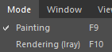

# Mode menu

   
The mode menu allows to switch the interface of Substance 3D Painter between different modes, each one having a dedicated purpose.

| Action | Description |
| --- | --- |
| **Painting** | This mode allows to work over the 3D model and to manipulate the layer stack. |
| **Rendering** | This mode allows to switch to the non-realtime renderer with the current project. For more information see the dedicated page: [ Iray Renderer](../../../features/iray-renderer/iray-renderer.md). |
