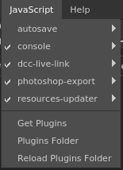
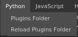

# Plugins menu

    
The plugin menus lists all the available plugins that are loaded by the application at startup.  
Each plugin discovered by the application will add an entry in the menu to access additional functions. Plugins are separated into two menus based on the scripting API they are using (Javascript of Python). Each plugin give access to the following action:

* **disable/enable**: changes the availability of the plugin.
* **reload**: allows to reload the plugin in case the script changed while the application was running.
* **configure**: if supported by the plugin, displays the function/window to configure the plugin.
* **about**: if supported by the plugin, displays an informative window about the plugin.

To find more information about the default plugins provided with the application or how to create a new one, see the dedicated [Plugins](../../../features/plugins/plugins.md) page.
