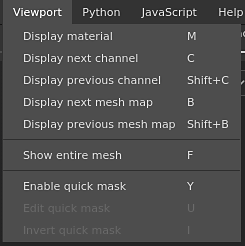

# Viewport menu

The viewport menu can be used to change the display mode of the [Viewports](https://substance3d.adobe.com/).

| Action | Description |
| --- | --- |
| **Display material** | Switch the viewports to **Material** mode which shows the 3D model with lighting and shading. |
| **Display next channel** | Switch the viewports to solo mode to display the next Texture Set channel. |
| **Display previous channel** | Switch the viewports to solo mode to display the previous Texture Set channel. |
| **Display next mesh map** | Switch the viewports to solo mode to display the next baked Mesh map type. |
| **Display previous mesh map** | Switch the viewports to solo mode to display the previous baked Mesh map type. |
| **Show entire mesh** | Adjust the viewport camera to center it on the 3D model. |
| **Enabled quick mask** | See the [Quick mask](../../../help/painting/tool-list/quick-mask/quick-mask.md) page for more information. |
| **Edit quick mask** | See the [Quick mask](../../../help/painting/tool-list/quick-mask/quick-mask.md) page for more information. |
| **Invert quick mask** | See the [Quick mask](../../../help/painting/tool-list/quick-mask/quick-mask.md) page for more information. |

For more information about the display modes see the [Display settings](../../../help/interface/display-settings/display-settings.md).

For more information about the Quick Mask see the [dedicated page](../../../help/painting/tool-list/quick-mask/quick-mask.md).
