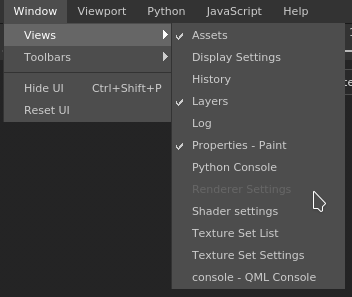

# Window menu

  
The window menu allows to display a list of the windows and if they are visible in the interface. You can also use the toolbar menu to hide some toolbars.

| Action | Description |
| --- | --- |
| **Views** | Lists the windows available in the interface (the checkbox indicate if it is currently visible). |
| **Toolbars** | Lists the toolbars available in the interface (the checkbox indicate if it is currently visible, which allows to toggle them): Docks, Plugins &amp; Tools. |
| **Hide UI** | Hides all the windows and docks of the interface and maximize the viewport(s). |
| **Reset UI** | Resets the current window layout to default. |
