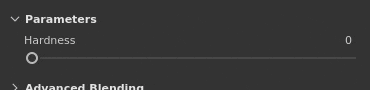

# Sliders

This page shows how to use the sliders in the application interface.

| Action | Example | Description |
| --- | --- | --- |
| **Drag** | 

 | Click and drag when hovering a slider to change its value. |
| **Precision drag** | 

 | Press and maintain the Shift key on the keyboard while clicking to increase the drag distance of the slider. This shortcut allows to tweak more precisely the slider while dragging it. |
| **Jump** | 

 | Click anywhere on a slider to make jump to the value under the mouse position. |
| **Up / Down** | 

 | After getting the focus of a slider by clicking on it, use the Up and Down arrow keys on the keyboard to increase or decrease the value step by step. |
| **Value edition** | 

 | Click in the text field just above a slider to manually edit its value via the keyboard. |
