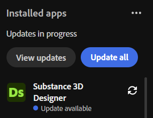

# Update checker

You can check for Substance 3D Painter updates from Creative Cloud Desktop. Navigate to the Apps tab, the look at the Installed apps section. **Update available** will appear under the app name if an update is ready for download.

You can access the release notes for the current release by opening Painter and using **Help > Release notes**.
