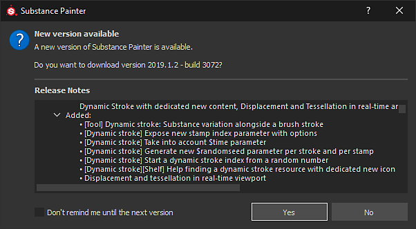

# Update checker

{width="450px"}

The update window indicates if a new version of the application is available and display as well the latest [Release notes](../../../release-notes/release-notes.md).

This window automatically appears during startup if a new version is available to download. To manually check for updates use **Check for updates** in the [ Help menu](../../../interface/main-menu/help-menu/help-menu.md).

It is possible to avoid displaying this window during the startup with the following methods:

* Use the **Don't remind me until next version** setting in the window to temporarily skip the display of the window until the next new version.
* Disable the **Check for updates** setting in the [General preferences](https://helpx.adobe.com/substance-3d/unlisted/documentation/spdoc/general-71008262.html).
