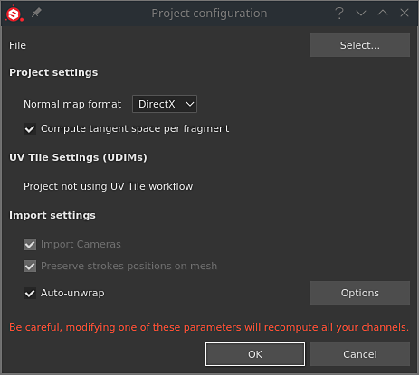

# Project configuration

{width="400px"}

The project setting window allows to modify a few properties related to the current project, such as the reloading of a new mesh.

## 3D model path

The File and Select button allows to update the current project's 3D model at any moment. This allows to:

* Update the 3D model topology
* Update the UVs
* Add or Remove [Texture Sets](../../interface/texture-set/texture-set.md)

>[!NOTE]
>
> If the materials changed or have been renamed when loading a new 3D model, the previous Texture Sets in the project can become disabled. This can be fixed with the [Reassignment Window](../../interface/texture-set/texture-set-reassignment/texture-set-reassignment.md) from the **Texture Set List**.

## Project Settings

This sections control several settings related to the project:

| *Setting* | *Description* |
| --- | --- |
| **Normal Map Format** | Defines the format of the normal map used for the mesh in the viewport.  This parameter only affects the [shaders](../../interface/shader-settings/shader-settings.md) in the viewport and mesh maps in the [bakers](../../baking/baking.md). The layer stack is independent.Recommended value for common applications:<ul data-preserve-html="true"><li data-preserve-html="true"><strong>Unity</strong>: OpenGL</li><li data-preserve-html="true"><strong>Unreal Engine</strong>: DirectX</li><li data-preserve-html="true"><strong>Maya</strong>: OpenGL</li><li data-preserve-html="true"><strong>3DS Max</strong>: DirectX</li><li data-preserve-html="true"><strong>Blender</strong>: OpenGL</li></ul> |
| **Compute Tangent Space Per Fragment** | Determines how to compute and display normal maps in the viewport for shading and lighting. If enabled, the tangent and binormals of the mesh will be computed per pixels instead of per vertex.Recommended value for common applications:<ul data-preserve-html="true"><li data-preserve-html="true"><strong>Unity</strong>: Disabled (Enabled if using HDRP)</li><li data-preserve-html="true"><strong>Unreal Engine</strong>: Enabled</li></ul> |

>[!NOTE]
>
> Changing the normal format or the tangent computation requires to re-bake the mesh maps to ensure that the look in the viewports is correct.

### File type-specific settings

When a USD mesh format is selected, other file type-specific settings become available.

{width="473px"}

| *Parameter* | *Description* |
| --- | --- |
| **Scope and variants** | Allows to select a specific part of a USD file. By default, it is set to 'Root', which means the entire USD file will be used in the Painter project.  **Change...** opens a new window that displays the content of the USD. If variants are detected, it is possible to select a specific variant to load in the project.Note that -<ul data-preserve-html="true"><li data-preserve-html="true">Only the modeling variant selection will have any impact.</li><li data-preserve-html="true">Variants nested within variants are not currently detected. </li></ul> |
| **Subdivision level** | Applies to geometry that has subdivision. It allows to specify how much you would like to subdivide your mesh for texturing in Painter. If subdivision is explicitly set to 'none' within the USD file, this setting is grayed out. Subdivision is applied after UV unwrapping, so it would not alter the shape of the mesh's UVs. |
| **Frame** | Applies to USDs in which animation is detected. It allows you to select the frame which will be used to load a Painter project. If there is no animation in the selected USD file, this setting is grayed out. |

## UV Tiles settings

This section indicates if the current project is using any of the UV Tiles/UDIM texture workflow in the current project. For more information see the [UV Tiles documentation](../../features/uv-tiles/uv-tiles.md).

## Import settings

These settings control how the selected mesh will be imported:

| *Setting* | *Description* |
| --- | --- |
| **Import Cameras** | If enabled, cameras present in the mesh file will also be imported and available in the 3D viewport as new point of view. |
| **Preserve strokes positions on mesh** | This setting controls how brush strokes will be recomputed after importing a new 3D mesh. It is recommended to keep this setting enabled in most cases. For more details see the [UV Reprojection](../../features/uv-reprojection/uv-reprojection.md) documentation. |
| **Auto-Unwrap** | Automatic UV Unwrapping. Click on the Option button to configure the process. For more information see the dedicated documentation. |

### Color management settings

This section controls the settings regarding how to convert colors. For more information see the [Color management](../../features/color-management/color-management.md) documentation.
