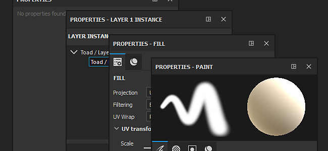

# Properties

The Properties window is where the tool and brush parameters as well as the layer properties can be modified. The Properties window can be accessed by using the [Dock Toolbar](../toolbars/toolbars.md) or by simply **right-clicking** in the [Viewport menu](https://helpx.adobe.com/substance-3d/unlisted/documentation/spdoc/viewport-170460351.html).

For more information about which parameters are available and what they do refer to the documentation of each tool and layer :

* [Tools Properties](../../painting/painting.md)
* [Fill Layer Properties](../../painting/fill-projections/fill-projections.md)
* [Effects Properties](../../features/effects/effects.md)
