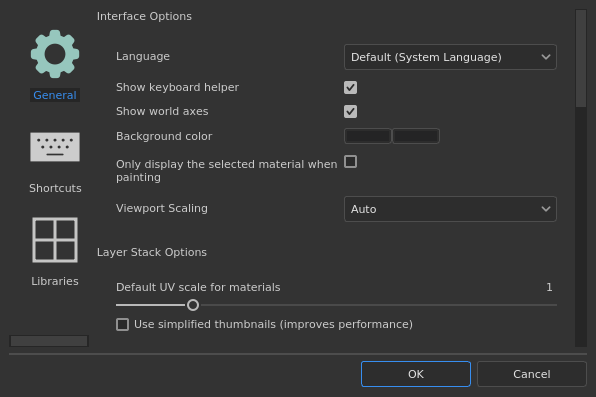
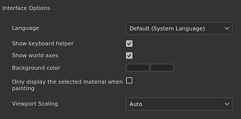
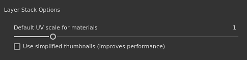
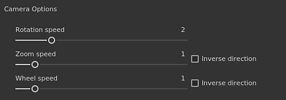
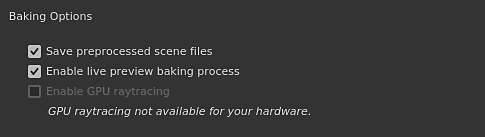
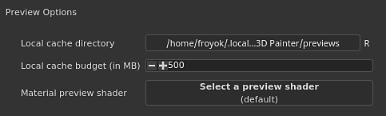
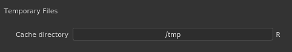
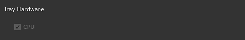

# General preferences

   
  
This page explains the main settings of the application.

## Interface options

| Setting | Description |
| --- | --- |
| **Language** | Define the language used by the interface in the application. This setting requires a restart of the application to take effect.Possible values:<ul data-preserve-html="true"><li data-preserve-html="true"><strong>Default (system language)</strong>: retrieve the compatible language from the operating system</li><li data-preserve-html="true"><strong>English</strong></li><li data-preserve-html="true"><strong>German</strong></li><li data-preserve-html="true"><strong>French</strong></li><li data-preserve-html="true"><strong>Japanese</strong></li><li data-preserve-html="true"><strong>Chinese</strong> (simplified)</li></ul> |
| **Show keyboard helper** | If enabled, displays the keyboard shortcuts at the bottom left of the viewports when pressing a key (like CTRL or SHIFT). |
| **Show world axes** | If enabled, shows the world axis in the bottom right of the 3D view. |
| **Background color** | Chooses the colors used as a background for the viewports. Two colors are available to create a gradient. |
| **Only display the selected material when painting** | If enabled, only the Texture Set currently selected will be displayed in the 3D view when painting (hiding temporarily the other Texture Sets).  **Note:**  It is recommended to keep this setting off as quickly changing the visibily in the viewport can impact performance of the [Sparse Virtual Textures](../../../features/sparse-virtual-textures/sparse-virtual-textures.md). |
| **Viewport Scaling** | Allows to reduce the resolution of the viewport for HDPI/Retina screens to improve performances.Possible value:<ul data-preserve-html="true"><li data-preserve-html="true"><strong>None</strong>: no scaling, viewport is rendered at the native screen resolution.</li><li data-preserve-html="true"><strong>Auto</strong>: divide the screen resolution by two (on HDPI screens only).</li></ul> |

## Layer stack options

| Setting | Description |
| --- | --- |
| **Default UV scale for materials** | Defines the default tiling/repetition value for fill layers and fill effect in the layer stack when applying materials. |
| **Use simplified thumbnails** | If enabled, the layer stack will only display icons instead of computing thumbnails. Using icons improve performances. This setting doesn't apply to projects using the UV Tile workflow as they will always display icons. |

## Camera options

| Setting | Description |
| --- | --- |
| **Rotation speed** | Multiplier of the default rotation speed of camera in the viewports. |
| **Zoom speed** | Multiplier of the default zoom speed of the camera in the viewports.Inverse direction allows to reverse the direction of the zoom based on the mouse movement. |
| **Wheel speed** | Multiplier for the zoom speed of the mouse wheel.Inverse direction allows to reverse the direction of the zoom based on the wheel movement. |

## Baking options

| Setting | Description |
| --- | --- |
| **Save preprocessed scene files** | If enabled, pre-processed high-poly meshes used by the bakers will be saved on disk for future re-use. This setting allows to re-bake more quickly. |
| **Enable live preview baking process** | If enabled, the 3D and 2D viewport will display the current baker texture being computed on the mesh. |
| **Enable GPU Raytracing** | If enabled, the Bakers will try to use the GPU for performing raytracing instead of the CPU. The feature allows bakers to perform faster in general.This can only be enabled on compatible hardware. See the [System requirements](../../../getting-started/system-requirements/system-requirements.md) for more details. |

## Preview options

| Setting | Description |
| --- | --- |
| **Local cache directory** | Define the secondary location to where resource thumbnails are located when generated.This setting is useful to compute and store resource thumbnails when a resource path is read-only (like on a network path with only read access). This avoid recomputing thumbnails at each startup because they would not be saved on disk otherwise. |
| **Local cache budget (in MB)** | Define the maximum size of the cache for the local cache. |
| **Material preview shader** | Define a shader to use to generate materials thumbnails in shelves. This is useful if resources use a different workflow than the default shader. This setting requires to restart the application to take effect. |

## Temporary Files

| Setting | Description |
| --- | --- |
| **Cache directory** | Defines the location where temporary files are written. This includes the [Sparse Virtual Textures](../../../features/sparse-virtual-textures/sparse-virtual-textures.md) cache. This setting can be overridden by an [Environment variables](../../../pipeline-and-integration/configuration/environment-variables/environment-variables.md). |

## Sparse virtual textures

| Setting | Description |
| --- | --- |
| **Hardware support acceleration** | If enabled, the application will try to use the Sparse textures with the GPU. For more details see the [Sparse Virtual Textures](../../../features/sparse-virtual-textures/sparse-virtual-textures.md) page. This setting can be overridden by an [Environment variables](../../../pipeline-and-integration/configuration/environment-variables/environment-variables.md). |

## Iray hardware

This section lists all the compatible hardware available that can be used when rendering with Iray.

The CPU setting is available on all computers. If the computer has a  **Nvidia GPU**  with a version of CUDA compatible it will also be listed here.

>[!NOTE]
>
> It is recommended to disable the CPU and keep only the GPU hardware enabled to ensure the best rendering performance. Having both CPU and GPU enabled together can increase the rendering time.

## Privacy

| Setting | Description |
| --- | --- |
| **Automatically send usages statistics** | If enabled, send information anonymously about the computer hardware configuration along other usage data. These data help us develop and improve the software. |
