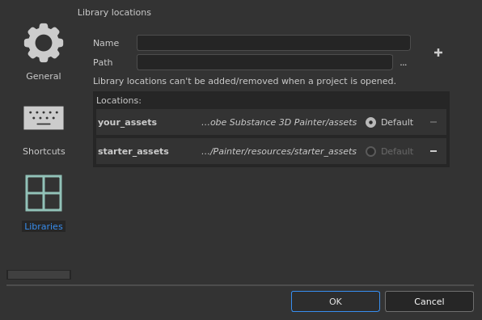
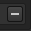

# Libraries configuration

   
  
This section allow to specify custom paths to additional resource folders and in which location resources should be saved by default.

## Default paths

By default two paths are pre-defined:

| Name | Location |
| --- | --- |
| **your\_assets** | This path is located in the Documents folder of the current user profile. This is where resources such as presets are created by default from within the application.(Named "shelf" in older versions.) |
| **starter\_assets** | This path is located within the installation folder of the application. It contains the default resources. (Named "allegorithmic" or "substance" in older versions.) |

The **default** radio button is used to define in which path new content (such as Brush presets, Material presets or Smart Materials) will be saved.

## Adding a new path

>[!NOTE]
>
> A path can only be created/modified if no project is currently open.

| Setting | Description |
| --- | --- |
| **Name** | The named that will be used to reference the path in the interface (when right-clicking on a resource for example). This name also defines the internal location name for resources to track if they are up to date or not, therefore it is advised to not changed this name once defined. |
| **Path** | The actual location where resources are (or will be) on the disk. |
| **Plus button**  

 | Clicking on this button will add the path defined by the name and path settings to the list below.Adding a new path will automatically create the necessary sub-folders structure needed to organize the data and resources. To learn where to put resources see:  [Adding Content to the Shelf](https://helpx.adobe.com/substance-3d/unlisted/documentation/spdoc/adding-content-to-the-shelf-142213317.html). |
| **Minus button**   

 | Clicking on this button in front of a path will remove it from the list. Resources will not be listed anymore in the [Assets](../../assets/assets.md) interface.  **Note:**  The default paths cannot be removed, but they will become disabled and their resources will be hidden instead. |
