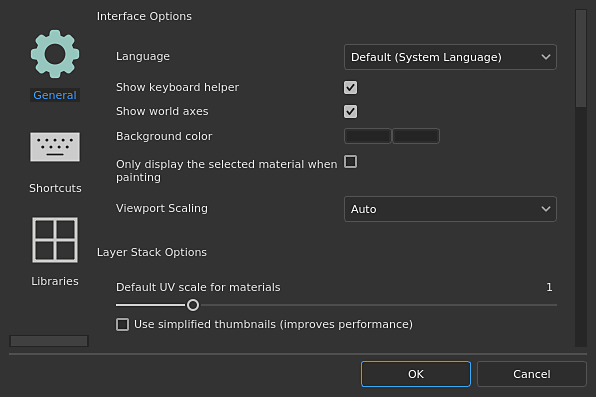

# Settings

{width="400px"}

Open the <b>Settings </b>from the <b>Edit menu </b>to adjust your preferences around how you work with Painter.

The <b>Settings </b>are divided into three sections:

* [General preferences](../../interface/settings/general-preferences/general-preferences.md)
* [Shortcuts](../../interface/settings/shortcuts/shortcuts.md)
* [Libraries configuration](../../interface/settings/libraries-configuration/libraries-configuration.md)
