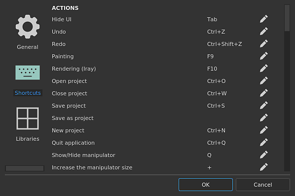
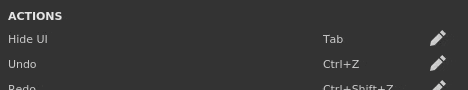

# Shortcuts

{width="400px"}

This page list all the keyboard and mouse shortcuts available.

## Shortcuts overview

For a quick overview of all the Shortcuts available, take a look at our graphic [available in our tutorials](https://helpx.adobe.com/substance-3d/unlisted/tutorials/courses/substance-3d-painter-keyboard-shortcuts.html) .

## How to change a shortcut

   
Click on the "pen" icon next to a shortcut to edit it and enter the new combination.Pressing the last key will automatically exit the edit mode and change the shortcut.

### List of editable shortcuts

To reset a shortcut back to its default value simply right-clicking on it.

| *Action* | *Shortcut (Windows)* | *Shortcut (MacOS)* | *Description* |
| --- | --- | --- | --- |
| <b> Hide UI </b> | Tab | Tab | Hide all the docks/windows of the interface to maximize the viewport(s). |
| <b> Undo </b> | Ctrl+Z | ⌘+Z | Cancel the last action and go back to the previous state. |
| <b> Redo </b> | Ctrl+Y | ⌘+Y | Go forward in the action list, redoing the action that has just been cancelled. |
| <b>Painting  </b> | F9 | F9 | Switch the interface to the Painting mode. |
| <b>Rendering (Iray) </b> | F10 | F10 | Switch the interface to the Rendering mode. |
| <b> Open project </b> | Ctrl+O | ⌘+O | Open the file open dialog of the system to load a project. |
| <b> Close project </b> | Ctrl+F4 | ⌘+W | Close the currently opened project. |
| <b> Save project </b> | Ctrl+S | ⌘+S | Save the currently opened project. |
| <b> Save as project </b> |  |  | Save the currently opened project under a new name. |
| <b> New project </b> | Ctrl+N | ⌘+N | Open the new project creation window. |
| <b> Quit application </b> | Alt+F4 | ⌘+Q | Close the application. |
|  |  |  |  |
| <b>Show/Hide manipulator</b> | Q | Q | Toggle the display of the manipulator used to control fill layer transforms. |
| <b>Increase the manipulator size</b> | + | + | Make the manipulator bigger in the viewports. |
| <b>Decrease the manipulator size</b> | - | - | Make the manipulator smaller in the viewports. |
| <b>Cycle through manipulation spaces</b> | T | T | Alternate between Object and World space transformation for the manipulator. |
| <b>Toggle warp edition mode</b> | Shift+V | Shift+V | Switch between the Warp transform and Edit vertices modes when editing a warp projection. |
| <b>Translate tool</b> | W | W | Set the manipulator mode to translation. |
| <b>Rotate tool</b> | E | E | Set the manipulator mode to rotation. |
| <b>Scale tool</b> | R | R | Set the manipulator mode to scale. |
| <b>Surface tool</b> | Shift+W | Shift+W | Set the manipulator mode to snap on the 3D model surface. |
| <b> Symmetry </b> | L | L | Enable the symmetry along a given axis. |
| <b>Pause engine computation</b> | Shift+Escape | Shift+Escape | Toggle engine computations. |
|  |  |  |  |
| <b> Select Paint tool </b> | 1 | 1 |  |
| <b> Select Paint tool + Particles </b> | Ctrl+1 | ⌘+1 |  |
| <b> Select Eraser tool </b> | 2 | 2 |  |
| <b> Select Eraser tool + Particles </b> | Ctrl+2 | ⌘+2 |  |
| <b> Select Projection tool </b> | 3 | 3 |  |
| <b> Select Projection tool + Particles </b> | Ctrl+3 | ⌘+3 |  |
| <b> Select Polygon Fill </b> | 4 | 4 |  |
| <b> Select Smudge tool </b> | 5 | 5 |  |
| <b> Select Clone tool (relative source) </b> | 6 | 6 |  |
| <b> Select Clone tool (absolute source) </b> | Ctrl+6 | ⌘+6 |  |
| <b>Bake Mesh Maps</b> | Ctrl+Shift+B | ⌘+Shift+B | Open the Baking settings window. |
| <b> Increase tool size </b> | <b>&#93;</b> | <b>&#93;</b> | Increase the size of the brush for the painting tool. |
| <b> Decrease tool size </b> | <b>&#91;</b> | <b>&#91;</b> | Decrease the size of the brush for the painting tool. |
| <b>Bake Mesh Maps</b> | Ctrl+Shift+B | ⌘+Shift+B | Open the Baking settings window. |
| <b> Invert grayscale tool </b> | X | X | Invert the current grayscale value if the painting tool is on a mask. |
| <b> Pick stroke material </b> | P | P | Enable the material picker tool. |
| <b> Lazy Mouse </b> | D | D | Enable the lazy mouse behavior on the current tool. |
| <b>Hide/ignore excluded geometry</b> | Alt+H | Option+H | Hide 3D model parts that were excluded via the Geometry Mask. |
|  |  |  |  |
| <b> Camera Perspective </b> | F5 | F5 | Change the camera of the viewport to a Perspective view. |
| <b> Camera Orthographic </b> | F6 | F6 | Change the camera of the viewport to an Orthographic view. |
| <b> Display next channel </b> | C | C | Switch the viewport to the Solo view mode and display the next channel of the current Texture Set. |
| <b> Display previous channel </b> | Shift+C | Shift+C | Switch the viewport to the Solo view mode and display the previous channel of the current Texture Set. |
| <b> Display material </b> | M | M | Switch the viewport display mode to Material. |
| <b> Display next mesh map </b> | B | B | Switch the viewport to the Solo view mode and display the next mesh map of the current Texture Set. |
| <b> Display previous mesh map </b> | Shift+B | Shift+B | Switch the viewport to the Solo view mode and display the previous mesh map of the current Texture Set. |
| <b> Toggle animation </b> | Space | Space | Pause/Unpause animation of the particles if a particle projection is in progress. |
| <b> Export textures </b> | Ctrl+Shift+E | Shift+⌘+E | Open the export textures window. |
| <b> Center the whole mesh </b> | F | F | Center the whole mesh of the current project in the middle of the viewport. |
| <b> Toggle quick mask edition </b> | U | U | Enter/Exit the quick mask edition. |
| <b> Clear quick mask </b> | Y | Y | Disable and clean the quick mask. |
| <b> Invert quick mask </b> | I | I | Invert the current values of the quick mask. |
| <b> Viewport layout 3D/2D </b> | F1 | F1 | Change the viewport display to show both the 3D and 2D view at the same time. |
| <b> Viewport layout 3D only </b> | F2 | F2 | Change the viewport display to show only the 3D view. |
| <b> Viewport layout 2D only </b> | F3 | F3 | Change the viewport display to show only the 2D view. |
| <b> Swap 2D / 3D view </b> | F4 | F4 | Swap between 2D and 3D view in viewport and 2D UV view. |
| <b> Texture Set isolate </b> | Alt+Q | Option+Q | Isolate the current Texture Set in the viewport by hiding the other. |
|  |  |  |  |
| <b> Use tool / paint </b> | Mouse left | Mouse left |  |
| <b> Draw straight lines </b> | Shift+Mouse left | Shift+Mouse left |  |
| <b> Draw straight lines with snapping </b> | Ctrl+Shift+Mouse left | Ctrl+Shift+Mouse left |  |
| <b> Camera rotate </b> | Alt+Mouse left | Option+left |  |
| <b> Camera snap rotate </b> | Alt+Shift+Mouse left | Shift+⌘+Mouse left | Snap camera rotation every 90 degrees angle. |
| <b> Camera translate </b> | Alt+Middle mouse | Option+⌘+Mouse left |  |
| <b> Camera translate (alternative) </b> | Ctrl+Alt+Mouse left |  |  |
| <b> Camera zoom </b> | Alt+Mouse right | Mouse middle |  |
| <b> Stencil rotate </b> | S+Mouse left | S+Mouse left |  |
| <b> Stencil snap rotate </b> | Shift+S+Mouse left | Shift+S+Mouse left |  |
| <b> Stencil translation </b> | S+Middle mouse |  |  |
| <b> Stencil zoom </b> | S+Right mouse | S+Right mouse |  |
| <b> Change tool Size / Hardness </b> | Ctrl+Mouse right | ⌘+Mouse right | Change size by moving horizontally, change hardness of brush by moving vertically. |
| <b> Change tool Flow / Rotation </b> | Ctrl+Mouse left | ⌘+Mouse left | Change flow of current brush by moving horizontally, change rotation of brush by moving vertically. |
| <b> Rotate environment </b> | Shift+Mouse right | Shift+Mouse right | Rotate horizontally the environment map used for the lighting in the viewport. |
| <b>Auto-Focus (Depth of Field)</b> | Ctrl+Middle mouse |  |  |
| <b> Texture set selection </b> | Ctrl+Alt+Mouse Right | Option+⌘+Mouse right |  |
| <b>Context menu </b> | Mouse right | Mouse right | Quick menu to access the properties window inside the viewport. |
| <b> Set Clone tool source location </b> | V+Mouse left | V+Mouse left |  |
|  |  |  |  |
| <b> Ignore stencil mask </b> | N | N | Temporarily disable the stencil (avoid to remove it entirely). |
| <b> Resume previous stroke </b> | A | A | Allow to continue the previously created brush stroke to avoid discontinuities. |

## List of non-Editable shortcuts

Some shortcuts may  **only work**  if the  **mouse is over**  the specific window.

Example:  **copy**  and  **pasting**  requires that the mouse is  **over the layer stack**.

| *Action* | *Shortcut (Windows)* | *Shortcut (MacOS)* | Description |
| --- | --- | --- | --- |
| **Copy layer** | Ctrl+C | ⌘+C | Copy the currently selected layer(s). |
| **Cut layer** | Ctrl+X | ⌘+X | Cut the currently selected layer(s). |
| **Paste layer** | Ctrl+V | ⌘+V | Paste the layer in memory(s). |
| **Delete layer** | Delete | Delete | Delete the currently selected layer(s). |
| **Duplicate layer** | Ctrl+D | ⌘+D | Duplicate the currently selected layer(s). |
| **Group layer** | Ctrl+G | ⌘+G | Put the currently selected layer(s) into a folder. |
| **Copy layer content** | Ctrl+Shift+C | Option+⌘+C | Copy the layer content (painting) and its effects. |
| **Paste layer content** | Ctrl+Shift+V | Option+⌘+V | Paste the content (painting) and effects currently in memory. |
| **Display mask in viewport** | Alt+Mouse left | Option+Mouse left | Switch the viewport display mode to the mask of the specified layer. |
| **Disable/Enable mask** | Shift+Mouse left | Shift+Mouse left | Toggle the state of the mask on a layer. |
|  |  |  |  |
| **Drag &amp; drop material** | CTRL+Drag&amp;Drop | ⌘+Drag&amp;Drop | Press and maintain this key while drag and dropping a material (or smart material) into the viewport to only affect a specific part of the 3D model. |
|  |  |  |  |
| **Manipulator constraint/snapping** | Shift | Shift | Snap transformation when adjusting the manipulator (translation or rotation) in 3D View. Constrain ratio when adjusting manipulator in 2D View. |
| **Manipulator mirror transformation** | Ctrl | ⌘ | Mirror manipulator points transformation around its pivot point in 2D View. |
