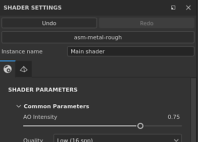
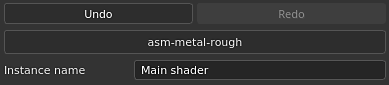
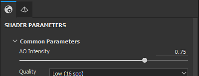
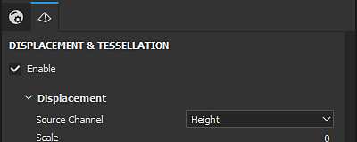

# Shader settings

The **Shaders Settings** window allows to control the shader (and Iray mdl) parameters and the geometry displacement parameters.

A shader is a function that defines how an object should look when interacting with lighting and shadows in the viewports. In this application shaders are used to know how to read the Texture Set channels and render the 3D mesh in the viewports.

## Undo stack and shader file

This section of the Shader Settings window controls the main parameters when manipulating shaders.   
The Undo/Redo stack for the shader is independent from the main  [History](https://substance3d.adobe.com/display/DRAFTPAINTER/History)  to not create conflicts when painting.

If the shader file is marked as "Outdated", it is recommended to update it when possible. See :  [Updating a Shader](https://substance3d.adobe.com/display/DRAFTPAINTER/Updating+a+Shader)

| *Setting* | *Description* |
| --- | --- |
| **Undo** | Revert/Cancel a change of shader file or any shader parameters modification |
| **Redo** | Apply again a change that was cancelled via the Undo. |
| **Shader file** | Button showing the current shader file used. Click on the button to open a mini-shelf and choose a different shader. |
| **Instance name** | Name of the shader instance. |
| **Restore defaults** | Restore all the shader parameters to their default values (as they are in the shader file). |

### Shader instance

A Shader Instance is a shader based on an original shader file but with customized parameters. A Shader Instance can be shared across Texture Sets, and a Texture Set can have a unique Shader Instance.

**For example:**  a project can use a base shader, while one texture set uses a custom shader to support opacity.

To create and manage Shader Instances, see the [Texture Set list](../../interface/texture-set/texture-set-list/texture-set-list.md) window.

## Shader parameters

Shader parameters are dependent of the shader file currently loaded.

## Displacement and tesselation

Displacement and Tesselation are two functionalities that can be used to modify the shape of an object to add further details.

* **Displacement**: Push or offset the geometry based on an input channel.
* **Tesselation**: Subdivide the geometry to densify it. More density means that the spacing between polygons is shorter which gives finer details.

A filter named "**Height To Normal**" is available in the Shelf and can be used to get the final normal map (in case the native conversion is not strong enough).

### Displacement

Below are the Displacement settings:

| *Setting* | *Description* |
| --- | --- |
| <b> Source Channel </b> | Channel from which the mesh deformation is based on. Default is Height but can be set to Displacement as well. |
| <b>Scale unit</b> | Select how the displacement scale is defined:<ul data-preserve-html="true"> <li data-preserve-html="true"><b>Normalized: </b>Displacement scale is relative to the bounding box size of the mesh.</li> <li data-preserve-html="true"><b>Scene: </b>Displacement scale is relative to the units of the imported scene file.</li> <li data-preserve-html="true"><b>Physical size (cm)</b>: Displacement scale is measured in cm based on the physical size of the object.</li> </ul> |
| <b> Scale amount</b> | Controls the amount of deformation applied to the mesh in the project based on the selected Scale unit. |

>[!NOTE]
>
> Both <b>Scene</b> and <b>Physical size (cm) </b>Scale unit settings require that the imported model has been prepared for physical size measurements. If the units are not correctly set up in the imported file, or if physical size units aren't supported by the imported file type, displacement will still work, but may not provide accurate results for your needs.

### Tesselation

Below are the Tesselation settings:

| *Setting* | *Description* |
| --- | --- |
| **Subdivision Mode** | Determines how the amount of subdivision is computed. Available configurations are :<ul data-preserve-html="true"><li data-preserve-html="true"> Uniform (default) </li><li data-preserve-html="true"> Edge Length </li></ul> |
| **Subdivision Count** | (Mode Uniform)From 1 to 32. A high value produce more polygons which gives more details but can introduce performance issues. |
| **Max Length** | (Mode Edge Length)1 / Value. Every polygon edge is divided until each segment is equal to or shorter than this number, 1/1 being the size of the scene. |
