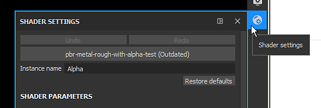
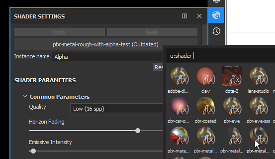
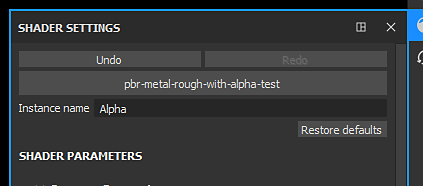
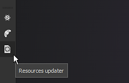
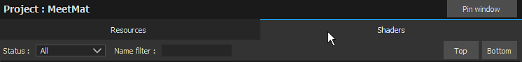
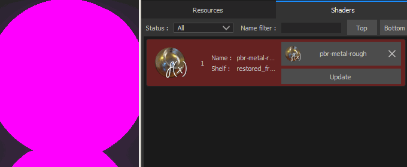

# Updating a shader

It can be necessary sometimes to update the shader used by a project in order to fix issues or take advantage of the latest features. This page describes how to do so.

Below is are two step by step method on how to update the shader of a project:

* **Update a Shader via the Shader Window**
* **Update a Shader via the Resource Updater plugin**

If a project use a  **custom shader**  (not shipped by default with Substance 3D Painter) refer to the  [Custom Shader](https://substance3d.adobe.com/display/DRAFTPAINTER/Shader+API)  page to get a guide on how to update it.

## Update a Shader via the Shader Window

### 1 - Open the Shader Settings window

The  **Shader settings**  window is available on the right by default in the Dock toolbar.

### 2 - Click on the shader button and select the updated shader

Click on the shader button (below the undo/redo button) and find the shader that match the one that was already used.

### 3 - Shader is updated

Once the new shader is loaded the mention **outdated** should be removed and the 3D model should appear normally in the viewport.

## Update a Shader via the Resource Updater plugin

### 1 - Open the Resource Updater

Go toward the left of the interface to find the  **Plugins toolbar**  and click on the  **Resource Updater**  icon.

### 2 - Switch to the Shader Tab

In the new window that appeared, click on the "Shader" tab to display the shader present in the current project.

### 3 - Find the Shader and update it

In the Shader tab should appear a list of all the Shader resources user by the current project. **Outdated**  Shader are visible with a  **red background**  . Click on the "update" button next to a resource to update it.

