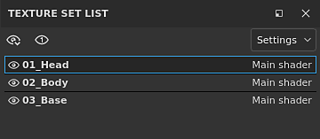
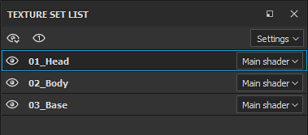
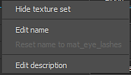
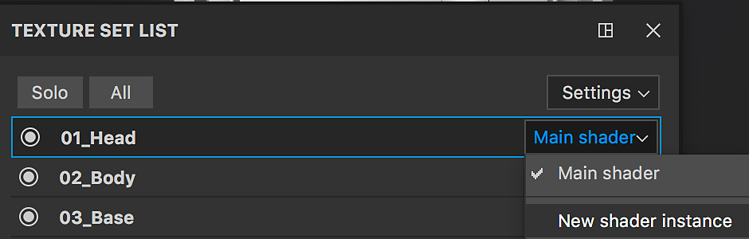

# Texture Set list

The **Texture Set List** window shows all the material IDs from the current 3D model in a project. It allows to switch and see the layer stack associated with each material on the model as well as their dedicated settings.

The main goal of the Texture Set List window is to allow to switch from one material to one another to access the layer stack associated with each material.   
In case of the [Material Layering](../../../features/dynamic-material-layering/dynamic-material-layering.md) workflow, the **sub-stacks** are displayed **below** the Texture Set name.

>[!WARNING]
>
> Only one texture set can be edited/painted at a time.

## Texture Set Status

Texture Sets can have multiple states :

* **Selected** : The current Texture Set currently being edited. Selecting a Texture Set will update the [Layer stack](../../layer-stack/layer-stack.md) and the [Shader settings](../../shader-settings/shader-settings.md) window accordingly.
* **Visible/Hidden** : See the visibility section below for more details.
* **Disabled** : This means the Texture Sets and its associated layer stack cannot be attached to a material in on the mesh. See the [Texture Set reassignment](../texture-set-reassignment/texture-set-reassignment.md) for more information.

## Visibility

The display of a Texture Set can be manager by the dedicated icons:

| *Icon* | *Action* | *Description* |
| --- | --- | --- |
| 

 | Open Menu | Open a new menu with the following actions:<ul data-preserve-html="true"><li data-preserve-html="true"><strong>Show All</strong>: Will display all the Texture Sets in the viewport.</li><li data-preserve-html="true"><strong>Hide All</strong>: Will hide all the Texture Sets in the viewport.</li><li data-preserve-html="true"><strong>Invert Show/Hide</strong>: Visible Texture Sets will become hidden, hidden Texture Sets will become visible.</li></ul> |
| 

 | Focus Mode | Isolate the currently active Texture Set and hide all the other while this mode is active. Click again on this button to exit the mode. |
| 

 | Visibility | Click on this button next to a Texture Set to hide or make visible a Texture Set in the viewport. |

>[!NOTE]
>
> By default, only the Texture Set which is being selected is displayed when **painting**. It is possible to change this behavior in the [Preferences](../../settings/settings.md) by unchecking "**Only display the material selected when painting**".  
> Note : hiding other Texture Sets while painting **improve performances**.

## Contextual Menu

When right-clicking on a Texture Set name, it opens a contextual menu with the following actions :

* **Show/Hide texture set** : toggle the visibility of the Texture Set (as described in the previous section)
* **Edit name** : allows to rename a Texture Set. This name will also be used during the export process of the Textures. Renaming is also possible by double-clicking on the Texture Set name.
* **Reset name to \*original name\*** : Restore the original Texture Set name from the mesh material if it has been changed.
* **Edit Description** : allows to add/change the description associated with a Texture Set.

## Shader Management

The button at the right of each Texture Set name can be used to manage the shader assignment.   
By default each texture set share the same shader instance. However it can be convenient sometimes to have a different shader only for a specific part of the mesh. This can be done by clicking on the button and choosing "**New shader instance**". From there, in the [Shader settings](../../shader-settings/shader-settings.md) window it is possible to change the shader and its parameters without affecting other Texture Sets.

{width="500px"}

## Settings

The settings button open a new menu that expose multiple actions :

* **Hide Empty Descriptions** (default) : Hide the description fields if empty
* **Hide All Descriptions** : Hide the descriptions fields even if not empty
* **Show All Descriptions** : Show the descriptions fields even if empty
* **Import Shader Parameters** : Allow to import a json file to configure the shader parameters of the Texture Sets
* **Reassign Texture Sets** : See the [Texture Set reassignment](../texture-set-reassignment/texture-set-reassignment.md) for more information.
